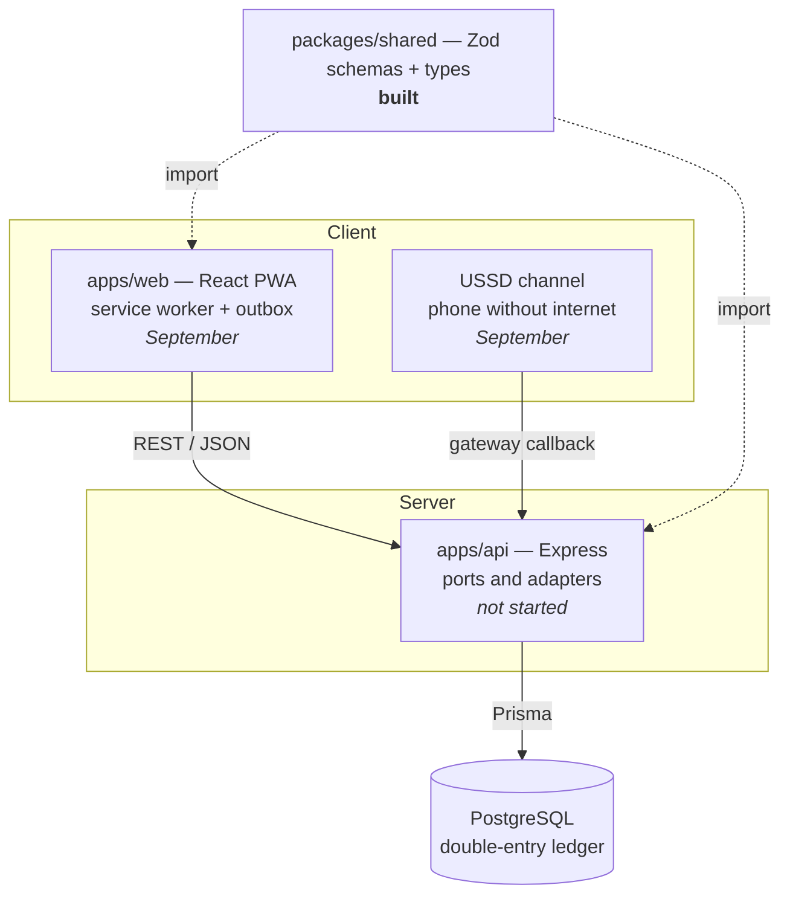

<div align="center">

# Wallet

**Multi-channel digital wallet — web PWA + USSD**

[](https://github.com/SanOft/wallet/actions/workflows/ci.yml)
[](https://www.typescriptlang.org/)
[](https://yarnpkg.com/)

**[English](#english)** · **[O'zbekcha](#ozbekcha)**

</div>

> [!IMPORTANT]
> **Demo funds only.** This is an educational / portfolio project. It handles no
> real money, connects to no bank or payment network, and holds no financial
> licence. Every balance in the system is play money issued by a treasury account.
>
> **Faqat demo pul.** Bu o'quv / portfolio loyihasi. Tizim haqiqiy pul bilan
> ishlamaydi, hech qaysi bank yoki to'lov tarmog'iga ulanmaydi va moliyaviy
> litsenziyaga ega emas. Barcha balanslar treasury hisobi chiqargan shartli pul.

---

## English

### What this is

A person-to-person wallet built around three problems that matter in emerging
markets:

| Problem | Answer in this system |
|---|---|
| Transfers need a stable internet connection | A USSD channel that works on a phone with no data, plus an offline outbox in the PWA |
| Users cannot tell whether money actually arrived | An explicit state machine — `queued`, `pending`, `completed`, `failed` — where `queued` is never rendered as `completed` |
| Most losses come from deceiving the user, not from breaking the software | Recipient name confirmation, new-recipient limits, velocity checks, and a notification on every outgoing transfer |

The engineering centre of the project is the **double-entry ledger**: every
transfer writes exactly two immutable rows that sum to zero, inside one
`Serializable` transaction, guarded by an idempotency key. `sum(ledger) = 0`
holds across the whole system, always.

### Status

The target for 31 August is a deployed, tested **backend** — "ledger live". The
frontend follows in September.

| Component | State |
|---|---|
| Monorepo scaffold — Yarn 4 workspaces, strict TypeScript | Done |
| `@wallet/shared` — phone, money, auth and error contracts | Done |
| `yarn verify` loop + CI on every pull request | Done |
| `@wallet/api` — Express, Prisma, ledger, transfers | Not started |
| `@wallet/web` — React PWA, offline outbox | September |
| USSD adapter | September |

`apps/api` and `apps/web` exist as empty workspace stubs. Nothing in this
repository talks to a database yet.

### Architecture



One rule holds the dependency graph straight: `packages/shared` imports nothing,
`apps/*` import only `packages/*`, and `apps/*` never import each other.

Every request and response schema lives in `packages/shared` as a Zod schema, so
the server validates against the same definition the client renders errors from.
Adding a language means adding a dictionary, never touching the API contract.

### Quick start

You need **Node `^22` or `>=24`** and nothing else installed globally — Yarn
ships with the repository through Corepack.

```bash
git clone git@github.com:SanOft/wallet.git
cd wallet
corepack enable
yarn install
yarn verify
```

`yarn verify` should finish green. That is the whole setup.

### The one command

There is exactly one command in this project. You run it, and CI runs the same
one, so "works on my machine" cannot happen.

```bash
yarn verify
```

It runs four stages, cheapest first — there is no reason to wait forty seconds
for a build when lint fails in two:

```
lint  →  typecheck  →  test  →  build
```

| Command | What it does |
|---|---|
| `yarn verify` | The full loop. Nothing is committed on a red one. |
| `yarn lint` | Biome — linting and formatting check |
| `yarn format` | Biome — apply formatting and safe fixes |
| `yarn typecheck` | TypeScript across every workspace, sources and tests |
| `yarn test` | Vitest |
| `yarn build` | Emits `dist/` in topological order |

**When it goes red:** read the *first* error only, fix that one thing, then run
the whole loop again from the top. Later errors are usually consequences of the
first, and a fix can break something upstream.

### Repository layout

```
wallet/
├── apps/
│   ├── api/              @wallet/api    — backend (stub)
│   └── web/              @wallet/web    — PWA (stub)
├── packages/
│   └── shared/           @wallet/shared — contracts, the only built package
│       ├── src/
│       │   ├── phone.ts    E.164, region registry, normalise, format
│       │   ├── money.ts    ISO 4217 minor units, limits, format
│       │   ├── auth.ts     register / login / public user / auth response
│       │   ├── error.ts    15 API codes, field codes, HTTP status map
│       │   └── index.ts    barrel
│       └── test/
├── docs/
│   ├── spec.md           what gets built
│   ├── runbook.md        in what order, and verified how
│   └── PARKING.md        ideas deferred while the architecture is frozen
├── biome.json
├── tsconfig.base.json    strict, plus eight extra flags
└── .github/workflows/ci.yml
```

### Design decisions worth knowing

- **Money is `BIGINT` in minor units.** IEEE 754 doubles cannot represent money
  exactly, so amounts travel through JSON as strings and the ISO 4217 exponent is
  read from a currency registry. Dividing by 100 is never hard-coded.
- **Errors are codes, not sentences.** `error.code` is a stable, language-neutral
  identifier; the client turns it into text. `message` is a debugging fallback.
- **A ledger row is never updated or deleted.** The repository API has no method
  that could; corrections are compensating entries.
- **Passwords are long, not complicated.** Fifteen characters minimum, no
  composition rules — following NIST SP 800-63B, since composition rules push
  users toward predictable substitutions.
- **TypeScript 7 is the native compiler.** It ships no JavaScript compiler API,
  which is why linting runs on Biome rather than typescript-eslint.

### Documentation

| Document | Contents |
|---|---|
| [`docs/spec.md`](docs/spec.md) | The technical specification: product, FR/NFR, architecture, data model, flows, API contract, UI/UX, threat model, test strategy |
| [`docs/runbook.md`](docs/runbook.md) | The execution plan: numbered tasks, the files each touches, acceptance criteria |
| [`docs/PARKING.md`](docs/PARKING.md) | Ideas raised while the architecture is frozen |

### Contributing

`main` is protected. Nothing merges without a green CI run.

- Branches: `feat/*`, `fix/*`, `chore/*`
- Commits: [Conventional Commits](https://www.conventionalcommits.org/)
- Every pull request states which FR or test scenario it relates to
- Never commit on a red `yarn verify`
- While the architecture is frozen, new ideas go to `docs/PARKING.md` rather than
  into the current branch

### License

Unlicensed. This is a portfolio project, published for reading rather than reuse.

---

## O'zbekcha

### Bu nima

Rivojlanayotgan bozorlar uchun uchta muammoni yechadigan shaxsdan-shaxsga pul
o'tkazish hamyoni:

| Muammo | Tizimdagi yechim |
|---|---|
| O'tkazma barqaror internetni talab qiladi | Internetsiz telefonda ishlaydigan USSD kanali va PWA ichidagi offline outbox |
| Foydalanuvchi puli yetib borganini bilmaydi | Aniq holatlar mashinasi — `queued`, `pending`, `completed`, `failed` — va `queued` hech qachon `completed` ko'rinishida chizilmaydi |
| Yo'qotishlarning asosiy qismi dasturni buzishdan emas, foydalanuvchini aldashdan keladi | Qabul qiluvchi ismini tasdiqlash, yangi qabul qiluvchiga limit, tezlik nazorati va har bir chiquvchi o'tkazmada bildirishnoma |

Loyihaning muhandislik markazi — **ikki yozuvli (double-entry) ledger**: har bir
o'tkazma bitta `Serializable` tranzaksiya ichida, idempotentlik kaliti himoyasida,
yig'indisi nolga teng bo'lgan aynan ikkita o'zgarmas qator yozadi. Butun tizim
bo'ylab `sum(ledger) = 0` har doim saqlanadi.

### Holat

31-avgustga maqsad — deploy qilingan va testlangan **backend**, ya'ni "ledger
live". Frontend sentyabrda.

| Komponent | Holat |
|---|---|
| Monorepo skeleti — Yarn 4 workspace'lari, qat'iy TypeScript | Tayyor |
| `@wallet/shared` — telefon, pul, auth va xato kontraktlari | Tayyor |
| `yarn verify` sikli va har bir PR uchun CI | Tayyor |
| `@wallet/api` — Express, Prisma, ledger, o'tkazmalar | Boshlanmagan |
| `@wallet/web` — React PWA, offline outbox | Sentyabr |
| USSD adapteri | Sentyabr |

`apps/api` va `apps/web` hozircha bo'sh workspace zaglushkalari. Repozitoriyda
hali hech narsa ma'lumotlar bazasi bilan gaplashmaydi.

### Arxitektura

Diagramma yuqoridagi [Architecture](#architecture) bo'limida — GitHub uni
avtomatik chizadi.

Bog'liqlik grafigini bitta qoida tik ushlab turadi: `packages/shared` hech
narsani import qilmaydi, `apps/*` faqat `packages/*` dan import qiladi va
`apps/*` bir-birini hech qachon import qilmaydi.

Har bir so'rov va javob sxemasi `packages/shared` da Zod sxemasi sifatida
yashaydi — server mijoz xatolarni chizadigan aynan o'sha ta'rifga qarab
validatsiya qiladi. Yangi til qo'shish lug'at qo'shishni anglatadi, API
kontraktiga tegishni emas.

### Tez boshlash

Sizga **Node `^22` yoki `>=24`** kerak, boshqa hech narsani global o'rnatish
shart emas — Yarn repozitoriya bilan birga, Corepack orqali keladi.

```bash
git clone git@github.com:SanOft/wallet.git
cd wallet
corepack enable
yarn install
yarn verify
```

`yarn verify` yashil tugashi kerak. Sozlash shu bilan tamom.

### Yagona buyruq

Bu loyihada aynan bitta buyruq bor. Uni siz ishga tushirasiz, xuddi shuni CI ham
ishga tushiradi — shuning uchun "mening kompyuterimda ishlayapti" degan holat
bo'lishi mumkin emas.

```bash
yarn verify
```

U to'rt bosqichni, eng arzonidan boshlab yurgizadi — lint 2 soniyada yiqilsa,
build'ni 40 soniya kutishning ma'nosi yo'q:

```
lint  →  typecheck  →  test  →  build
```

| Buyruq | Vazifasi |
|---|---|
| `yarn verify` | To'liq sikl. Qizil holatda hech narsa commit qilinmaydi. |
| `yarn lint` | Biome — lint va formatlash tekshiruvi |
| `yarn format` | Biome — formatlash va xavfsiz tuzatishlarni qo'llash |
| `yarn typecheck` | Barcha workspace'lar bo'ylab TypeScript, manba va testlar |
| `yarn test` | Vitest |
| `yarn build` | Topologik tartibda `dist/` chiqaradi |

**Qizil bo'lganda:** faqat *birinchi* xatoni o'qing, o'sha bittasini tuzating,
keyin butun siklni boshidan qayta yurgizing. Keyingi xatolar odatda birinchisining
oqibati, tuzatish esa yuqoridagi bosqichni buzishi mumkin.

### Repozitoriya tuzilishi

Tuzilish daraxti yuqoridagi [Repository layout](#repository-layout) bo'limida.

| Yo'l | Nima |
|---|---|
| `packages/shared/src/phone.ts` | E.164, region registri, normalizatsiya, formatlash |
| `packages/shared/src/money.ts` | ISO 4217 kichik birliklari, limitlar, formatlash |
| `packages/shared/src/auth.ts` | Ro'yxatdan o'tish / kirish / ochiq foydalanuvchi / auth javobi |
| `packages/shared/src/error.ts` | 15 ta API kodi, maydon kodlari, HTTP status xaritasi |
| `docs/spec.md` | Nima quriladi |
| `docs/runbook.md` | Qanday tartibda va qanday tekshirib |
| `tsconfig.base.json` | Qat'iy rejim va sakkizta qo'shimcha flag |

### Bilib qo'yishga arziydigan qarorlar

- **Pul — kichik birliklarda `BIGINT`.** IEEE 754 son turi pulni aniq ifodalay
  olmaydi, shuning uchun summalar JSON orqali satr sifatida yuriladi va ISO 4217
  darajasi valyuta registridan o'qiladi. 100 ga bo'lish hech qayerda qattiq
  yozilmagan.
- **Xatolar — kod, gap emas.** `error.code` — barqaror, tildan mustaqil
  identifikator; matnni undan mijoz yasaydi. `message` faqat debug uchun zaxira.
- **Ledger qatori hech qachon yangilanmaydi va o'chirilmaydi.** Repository
  API'sida buni qila oladigan metod umuman yo'q; tuzatish — kompensatsiya yozuvi.
- **Parol uzun bo'lsin, murakkab emas.** Kamida 15 belgi, tarkib bo'yicha qoidalar
  yo'q — NIST SP 800-63B ga ergashib, chunki bunday qoidalar foydalanuvchini
  oldindan taxmin qilinadigan almashtirishlarga itaradi.
- **TypeScript 7 — native kompilyator.** Uning JavaScript compiler API'si yo'q,
  shuning uchun lint typescript-eslint emas, Biome ustida ishlaydi.

### Hissa qo'shish

`main` himoyalangan. CI yashil bo'lmaguncha hech narsa merge bo'lmaydi.

- Branchlar: `feat/*`, `fix/*`, `chore/*`
- Commitlar: [Conventional Commits](https://www.conventionalcommits.org/)
- Har bir PR qaysi FR yoki test ssenariysiga tegishli ekanini ko'rsatadi
- Qizil `yarn verify` ustida hech qachon commit qilinmaydi
- Arxitektura muzlatilgan ekan, yangi g'oyalar joriy branchga emas,
  `docs/PARKING.md` ga yoziladi

### Litsenziya

Litsenziyasiz. Bu portfolio loyihasi — qayta ishlatish uchun emas, o'qish uchun
nashr qilingan.
