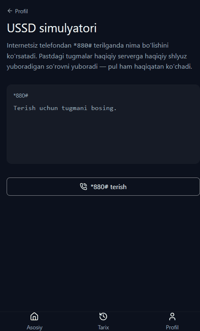
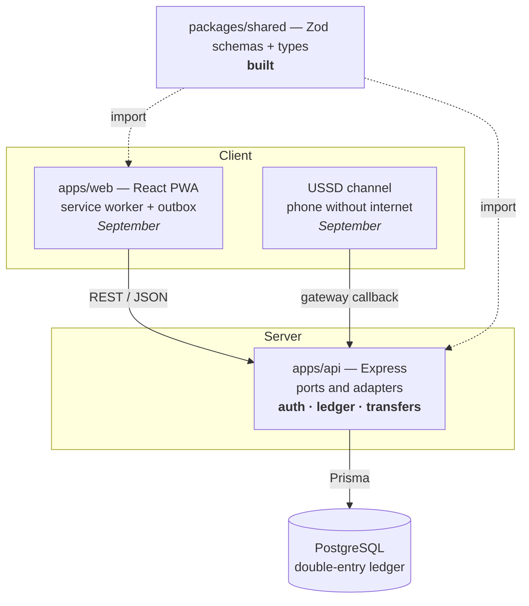

<div align="center">

# Wallet

**Multi-channel digital wallet — web PWA + USSD**

[](https://github.com/SanOft/wallet/actions/workflows/ci.yml)
[](https://www.typescriptlang.org/)
[](https://yarnpkg.com/)

**[English](#english)** · **[O'zbekcha](#ozbekcha)**

</div>

> [!IMPORTANT]
> **Demo funds only.** This is an educational / portfolio project. It handles no
> real money, connects to no bank or payment network, and holds no financial
> licence. Every balance in the system is play money issued by a treasury account.
>
> **Faqat demo pul.** Bu o'quv / portfolio loyihasi. Tizim haqiqiy pul bilan
> ishlamaydi, hech qaysi bank yoki to'lov tarmog'iga ulanmaydi va moliyaviy
> litsenziyaga ega emas. Barcha balanslar treasury hisobi chiqargan shartli pul.

---

## English

### What this is

A person-to-person wallet built around three problems that matter in emerging
markets:

| Problem | Answer in this system |
|---|---|
| Transfers need a stable internet connection | A USSD channel that works on a phone with no data, plus an offline outbox in the PWA |
| Users cannot tell whether money actually arrived | An explicit state machine — `queued`, `pending`, `completed`, `failed` — where `queued` is never rendered as `completed` |
| Most losses come from deceiving the user, not from breaking the software | Recipient name confirmation, new-recipient limits, velocity checks, and a notification on every outgoing transfer |

The engineering centre of the project is the **double-entry ledger**: every
transfer writes exactly two immutable rows that sum to zero, inside one
`Serializable` transaction, guarded by an idempotency key. `sum(ledger) = 0`
holds across the whole system, always.

### Status

The target for 31 August is a deployed, tested **backend** — "ledger live". The
frontend follows in September.

| Component | State |
|---|---|
| Monorepo scaffold — Yarn 4 workspaces, strict TypeScript | Done |
| `@wallet/shared` — phone, money, auth and error contracts | Done |
| `yarn verify` loop + CI on every pull request | Done |
| Schema — 7 tables, 9 CHECK constraints, 6 triggers | Done |
| Authentication — argon2, HS256, refresh rotation with reuse detection | Done |
| Double-entry ledger and P2P transfer | Done |
| Demo top-up, balance, recipient lookup | Done |
| Reconciliation job — `yarn workspace @wallet/api db:reconcile` | Done |
| Transport hardening — helmet, CORS allowlist, rate limits, gitleaks | Done |
| Transaction history (FR-5) | Done |
| Deploy — Neon + Render | Not started |
| `@wallet/web` — React PWA, offline outbox | Done |
| USSD adapter, and a browser simulator for it (FR-9.6) | Done |

Fifteen JSON endpoints and a health check run behind `apps/api`. The three
workspaces hold 565 tests between them — 261 for the API, 58 for the shared
contracts, 246 for the web app.

The invariants are enforced by the database rather than by the service that
writes to it: ledger rows reject `UPDATE`, `DELETE` and `TRUNCATE` outright, and
a deferred constraint trigger checks at COMMIT that a completed transfer left
exactly two entries, on the two accounts party to it, summing to zero. A bug in
application code cannot corrupt the ledger. Something with rights to `ALTER
TABLE` still can — see [`docs/PARKING.md`](docs/PARKING.md) P-4, which is
tracked as blocking a real deployment rather than as a nice-to-have.

### The USSD channel, in a browser

A phone with no data dials `*880#`. There is no real gateway in the MVP, so
`apps/web` ships one: a page that posts exactly what a gateway posts, and prints
exactly what comes back (FR-9.6).



It is a lab page rather than a feature, and it is built to be honest about the
channel rather than flattering to it:

- **`text` accumulates.** Every request carries the whole conversation —
  `""` → `"2"` → `"2*944298026"` → `"2*944298026*50000"` — because the server
  keeps no session. The request body is on screen while you dial.
- **The PIN is in that field, in clear.** The panel masks it by default and will
  show it on request. That is the evidence behind
  [ADR-0010](docs/adr/0010-pin-before-any-ussd-disclosure.md): GSM A5/1 is
  broken and NIST SP 800-63B classifies the PSTN as RESTRICTED, which is an
  abstract claim until you watch your own four digits appear in a form field.
- **182 septets, not 182 characters.** The counter above the screen measures the
  reply with the same function the adapter fits it with. One character outside
  the GSM 7-bit alphabet — the turned comma in "Gʻafur", any Cyrillic letter —
  collapses the budget to 70 and the network truncates the rest silently. So
  "Зулфия Каримова" arrives as `ZULFIYA K.`, transliterated rather than replaced,
  because the sender has to be able to recognise who they are paying.
- **The session dies after 180 seconds**, and the page says the network did it,
  not the server. A dial is never queued for later: the offline outbox that
  carries a failed transfer is the wrong answer here, and the page explains why
  instead of leaving a dead button.

Nothing on this page re-implements the menu. The gateway is deliberately dumb —
it forwards text and prints replies — because every piece of protocol knowledge
it does not have is a way it cannot drift from the real thing.

### Architecture



One rule holds the dependency graph straight: `packages/shared` imports nothing,
`apps/*` import only `packages/*`, and `apps/*` never import each other.

### The API

| Method | Path | Auth | Notes |
|---|---|---|---|
| `POST` | `/api/auth/register` | — | Answers identically whether the number is free or taken (FR-1.5) |
| `POST` | `/api/auth/login` | — | One generic failure for a wrong number and a wrong password alike |
| `POST` | `/api/auth/refresh` | refresh cookie | Rotates the token; reusing a spent one revokes the whole family |
| `POST` | `/api/auth/logout` | refresh cookie | |
| `GET` | `/api/me` | bearer | |
| `GET` | `/api/accounts` | bearer | Balances, as strings in minor units |
| `POST` | `/api/accounts/topup` | bearer | Requires `Idempotency-Key`; demo funds, three per 24h (FR-10.3) |
| `POST` | `/api/transfers` | bearer | Requires `Idempotency-Key` |
| `GET` | `/api/recipients/lookup` | bearer | Returns a masked name — `ALISHER N.` — capped at 20/hour (FR-4.9) |
| `GET` | `/health` | — | Checks the database, not just the process |

Every failure uses one envelope, so a client has a single error path to write:

```json
{ "error": { "code": "VALIDATION_ERROR", "message": "...", "requestId": "…",
             "details": [{ "path": ["amount"], "code": "money.below_minimum" }] }}
```

`details` carries per-field codes and appears on `VALIDATION_ERROR`; the other
codes — `INSUFFICIENT_FUNDS`, `LIMIT_EXCEEDED`, `IDEMPOTENCY_CONFLICT`,
`RATE_LIMITED` and the rest — arrive without it. Which HTTP status each maps to
is declared once, in `packages/shared`, and the same table decides whether a
failure is worth retrying.

Amounts are strings of minor units — `"300000"` is 3 000 so'm — because a JSON
number cannot carry a balance without losing tiyin.

Every request and response schema lives in `packages/shared` as a Zod schema, so
the server validates against the same definition the client renders errors from.
Adding a language means adding a dictionary, never touching the API contract.

### Quick start

You need **Node `^22` or `>=24`** and nothing else installed globally — Yarn
ships with the repository through Corepack.

```bash
git clone git@github.com:SanOft/wallet.git
cd wallet
corepack enable
yarn install
yarn verify
```

`yarn verify` should finish green. That is the whole setup.

### The one command

There is exactly one command in this project. You run it, and CI runs the same
one, so "works on my machine" cannot happen.

```bash
yarn verify
```

It runs four stages. Lint is first because it is the cheapest. Build is second,
not last: `apps/*` typecheck against the emitted types of `packages/*`, so on a
fresh clone there is nothing to typecheck against until the build has run.

```
lint  →  build  →  typecheck  →  test
```

| Command | What it does |
|---|---|
| `yarn verify` | The full loop. Nothing is committed on a red one. |
| `yarn lint` | Biome — linting and formatting check |
| `yarn format` | Biome — apply formatting and safe fixes |
| `yarn typecheck` | TypeScript across every workspace, sources and tests |
| `yarn test` | Vitest |
| `yarn build` | Emits `dist/` in topological order |

**When it goes red:** read the *first* error only, fix that one thing, then run
the whole loop again from the top. Later errors are usually consequences of the
first, and a fix can break something upstream.

### Repository layout

```
wallet/
├── apps/
│   ├── api/              @wallet/api    — Express backend
│   │   ├── prisma/       schema, migrations, treasury seed
│   │   ├── src/
│   │   │   ├── adapters/http/  routes, middleware, transport hardening
│   │   │   ├── domain/         auth and transfer services; knows nothing about HTTP
│   │   │   ├── infra/          Prisma, argon2, JWT, ledger repository, logger
│   │   │   └── jobs/           reconciliation (I-4), run on a schedule
│   │   └── test/
│   └── web/              @wallet/web    — PWA (stub)
├── packages/
│   └── shared/           @wallet/shared — contracts, the only built package
│       ├── src/
│       │   ├── phone.ts    E.164, region registry, normalise, format
│       │   ├── money.ts    ISO 4217 minor units, limits, format
│       │   ├── auth.ts     register / login / public user / auth response
│       │   ├── transfer.ts transfer, account, lookup schemas; name masking
│       │   ├── error.ts    19 API codes, field codes, HTTP status map
│       │   └── index.ts    barrel
│       └── test/
├── .agents/skills/       vendored agent skills, pinned in skills-lock.json
├── docs/
│   ├── spec.md           what gets built
│   ├── runbook.md        in what order, and verified how
│   ├── smoke-plan.md     what to check by hand before believing it
│   └── PARKING.md        known gaps, triaged against the product bar
├── biome.json
├── tsconfig.base.json    strict, plus eight extra flags
└── .github/workflows/ci.yml
```

### Design decisions worth knowing

- **Money is `BIGINT` in minor units.** IEEE 754 doubles cannot represent money
  exactly, so amounts travel through JSON as strings and the ISO 4217 exponent is
  read from a currency registry. Dividing by 100 is never hard-coded.
- **Errors are codes, not sentences.** `error.code` is a stable, language-neutral
  identifier; the client turns it into text. `message` is a debugging fallback.
- **A ledger row is never updated or deleted.** The repository API has no method
  that could; corrections are compensating entries.
- **Passwords are long, not complicated.** Fifteen characters minimum, no
  composition rules — following NIST SP 800-63B, since composition rules push
  users toward predictable substitutions.
- **TypeScript 7 is the native compiler.** It ships no JavaScript compiler API,
  which is why linting runs on Biome rather than typescript-eslint.

### Documentation

| Document | Contents |
|---|---|
| [`docs/spec.md`](docs/spec.md) | The technical specification: product, FR/NFR, architecture, data model, flows, API contract, UI/UX, threat model, test strategy |
| [`docs/runbook.md`](docs/runbook.md) | The execution plan: numbered tasks, the files each touches, acceptance criteria |
| [`docs/smoke-plan.md`](docs/smoke-plan.md) | Checking it by hand: one person, registration through a USSD transfer, against a local API and the PWA |
| [`docs/PARKING.md`](docs/PARKING.md) | Known gaps, triaged against the product bar |
| [`docs/adr/`](docs/adr/) | Decision records — what was chosen, what it cost, what was rejected |

### Contributing

`main` is protected. Nothing merges without a green CI run.

- Branches: `feat/*`, `fix/*`, `chore/*`
- Commits: [Conventional Commits](https://www.conventionalcommits.org/)
- Every pull request states which FR or test scenario it relates to
- Never commit on a red `yarn verify`
- While the architecture is frozen, new ideas go to `docs/PARKING.md` rather than
  into the current branch

### License

Unlicensed. This is a portfolio project, published for reading rather than reuse.

---

## O'zbekcha

### Bu nima

Rivojlanayotgan bozorlar uchun uchta muammoni yechadigan shaxsdan-shaxsga pul
o'tkazish hamyoni:

| Muammo | Tizimdagi yechim |
|---|---|
| O'tkazma barqaror internetni talab qiladi | Internetsiz telefonda ishlaydigan USSD kanali va PWA ichidagi offline outbox |
| Foydalanuvchi puli yetib borganini bilmaydi | Aniq holatlar mashinasi — `queued`, `pending`, `completed`, `failed` — va `queued` hech qachon `completed` ko'rinishida chizilmaydi |
| Yo'qotishlarning asosiy qismi dasturni buzishdan emas, foydalanuvchini aldashdan keladi | Qabul qiluvchi ismini tasdiqlash, yangi qabul qiluvchiga limit, tezlik nazorati va har bir chiquvchi o'tkazmada bildirishnoma |

Loyihaning muhandislik markazi — **ikki yozuvli (double-entry) ledger**: har bir
o'tkazma bitta `Serializable` tranzaksiya ichida, idempotentlik kaliti himoyasida,
yig'indisi nolga teng bo'lgan aynan ikkita o'zgarmas qator yozadi. Butun tizim
bo'ylab `sum(ledger) = 0` har doim saqlanadi.

### Holat

31-avgustga maqsad — deploy qilingan va testlangan **backend**, ya'ni "ledger
live". Frontend sentyabrda.

| Komponent | Holat |
|---|---|
| Monorepo skeleti — Yarn 4 workspace'lari, qat'iy TypeScript | Tayyor |
| `@wallet/shared` — telefon, pul, auth va xato kontraktlari | Tayyor |
| `yarn verify` sikli va har bir PR uchun CI | Tayyor |
| Sxema — 7 jadval, 9 CHECK cheklovi, 6 trigger | Tayyor |
| Autentifikatsiya — argon2, HS256, reuse aniqlash bilan refresh rotatsiyasi | Tayyor |
| Ikki yozuvli ledger va P2P o'tkazma | Tayyor |
| Demo to'ldirish, balans, qabul qiluvchini qidirish | Tayyor |
| Solishtirish (reconciliation) jobi — `yarn workspace @wallet/api db:reconcile` | Tayyor |
| Transport himoyasi — helmet, CORS ro'yxati, so'rov limitlari, gitleaks | Tayyor |
| Tranzaksiyalar tarixi (FR-5) | Tayyor |
| Deploy — Neon va Render | Boshlanmagan |
| `@wallet/web` — React PWA, offline outbox | Tayyor |
| USSD adapteri va uning brauzer simulyatori (FR-9.6) | Tayyor |

`apps/api` ortida o'n beshta JSON endpoint va bitta health tekshiruvi ishlaydi.
Uchta workspace jami 565 ta testni saqlaydi — API uchun 261, umumiy
kontraktlar uchun 58, web ilova uchun 246.

Invariantlarni unga yozadigan xizmat emas, balki bazaning o'zi ushlab turadi:
ledger qatorlari `UPDATE`, `DELETE` va `TRUNCATE` ni butunlay rad etadi, kechiktirilgan
constraint trigger esa COMMIT paytida tugallangan o'tkazma aynan ikkita yozuv
qoldirganini, ular o'tkazmaga aloqador ikki hisobda ekanini va yig'indisi nol
ekanini tekshiradi. Dastur kodidagi xato ledgerni buza olmaydi. `ALTER TABLE`
huquqiga ega narsa esa hali ham buzishi mumkin — [`docs/PARKING.md`](docs/PARKING.md)
dagi P-4 ga qarang: u haqiqiy deploy uchun to'siq deb belgilangan.

### USSD kanali, brauzerda

Internetsiz telefon `*880#` ni teradi. MVPda haqiqiy shlyuz yo'q, shuning uchun
`apps/web` uni o'zi taqdim etadi: shlyuz yuboradigan so'rovning aynan o'zini
yuboradigan va qaytgan javobni aynan ko'rsatadigan sahifa (FR-9.6).


Bu sahifa "labs" bo'limida — kanalni bezab emas, borligicha ko'rsatish uchun
qurilgan:

- **`text` to'planib boradi.** Har bir so'rov butun suhbatni olib yuradi —
  `""` → `"2"` → `"2*944298026"` → `"2*944298026*50000"` — chunki server
  sessiyani saqlamaydi. So'rov tanasi terish davomida ekranda turadi.
- **PIN o'sha maydonda, ochiq matn sifatida ketadi.** Panel uni sukut bo'yicha
  yashiradi va so'ralganda ko'rsatadi. Bu
  [ADR-0010](docs/adr/0010-pin-before-any-ussd-disclosure.md) ning dalili: GSM
  A5/1 buzilgan va NIST SP 800-63B PSTN ni RESTRICTED deb tasniflaydi — bu o'z
  to'rt raqamingiz forma maydonida paydo bo'lganini ko'rmaguningizcha mavhum
  da'vo bo'lib qoladi.
- **182 belgi emas, 182 septet.** Ekran ustidagi hisoblagich javobni adapter
  ishlatadigan o'sha funksiya bilan o'lchaydi. GSM 7-bit alifbosidan tashqaridagi
  bitta belgi — "Gʻafur" dagi tutuq belgisi yoki istalgan kiril harfi — chegarani
  70 ga tushiradi va tarmoq qolganini jimgina kesadi. Shuning uchun "Зулфия
  Каримова" `ZULFIYA K.` bo'lib yetib boradi: almashtirilmay, transliteratsiya
  qilinadi, chunki yuboruvchi kimga to'layotganini tanishi shart.
- **Sessiya 180 soniyadan keyin o'ladi**, va sahifa buni serverni emas, tarmoqni
  aybdor qilib aytadi. Terish hech qachon navbatga qo'yilmaydi: muvaffaqiyatsiz
  o'tkazmani saqlaydigan offline outbox bu yerda noto'g'ri javob, va sahifa
  o'lik tugma qoldirish o'rniga sababini tushuntiradi.

Bu sahifada menyu qaytadan yozilmagan. Shlyuz ataylab "ahmoq" — u matnni uzatadi
va javobni chiqaradi, xolos — chunki uning protokol haqida bilmagan har bir
narsasi haqiqiy shlyuzdan uzoqlashib ketolmasligining kafolati.

### Arxitektura

Diagramma yuqoridagi [Architecture](#architecture) bo'limida — GitHub uni
avtomatik chizadi.

Bog'liqlik grafigini bitta qoida tik ushlab turadi: `packages/shared` hech
narsani import qilmaydi, `apps/*` faqat `packages/*` dan import qiladi va
`apps/*` bir-birini hech qachon import qilmaydi.

Har bir so'rov va javob sxemasi `packages/shared` da Zod sxemasi sifatida
yashaydi — server mijoz xatolarni chizadigan aynan o'sha ta'rifga qarab
validatsiya qiladi. Yangi til qo'shish lug'at qo'shishni anglatadi, API
kontraktiga tegishni emas.

### API

| Metod | Yo'l | Auth | Izoh |
|---|---|---|---|
| `POST` | `/api/auth/register` | — | Raqam bo'sh yoki bandligidan qat'i nazar bir xil javob (FR-1.5) |
| `POST` | `/api/auth/login` | — | Noto'g'ri raqam va noto'g'ri parolga bitta umumiy xato |
| `POST` | `/api/auth/refresh` | refresh cookie | Tokenni almashtiradi; ishlatilganini qayta yuborish butun oilani bekor qiladi |
| `POST` | `/api/auth/logout` | refresh cookie | |
| `GET` | `/api/me` | bearer | |
| `GET` | `/api/accounts` | bearer | Balanslar — kichik birliklarda, satr sifatida |
| `POST` | `/api/accounts/topup` | bearer | `Idempotency-Key` shart; demo pul, 24 soatda uchtagacha (FR-10.3) |
| `POST` | `/api/transfers` | bearer | `Idempotency-Key` shart |
| `GET` | `/api/recipients/lookup` | bearer | Niqoblangan ism qaytaradi — `ALISHER N.` — soatiga 20 ta (FR-4.9) |
| `GET` | `/health` | — | Nafaqat jarayonni, bazani ham tekshiradi |

Har qanday xato bitta konvertda keladi, ya'ni mijozda bitta xato yo'li bo'ladi:

```json
{ "error": { "code": "VALIDATION_ERROR", "message": "...", "requestId": "…",
             "details": [{ "path": ["amount"], "code": "money.below_minimum" }] }}
```

`details` maydon kodlarini tashiydi va faqat `VALIDATION_ERROR` da bo'ladi;
qolgan kodlar — `INSUFFICIENT_FUNDS`, `LIMIT_EXCEEDED`, `IDEMPOTENCY_CONFLICT`,
`RATE_LIMITED` va boshqalar — usiz keladi. Qaysi kod qaysi HTTP statusga
mos kelishi bir joyda, `packages/shared` da e'lon qilingan; xatoni qayta
urinishga arziydimi degan savolga ham o'sha jadval javob beradi.

Summalar kichik birliklarda satr sifatida yuboriladi — `"300000"` bu 3 000 so'm
— chunki JSON soni balansni tiyinini yo'qotmasdan tashiy olmaydi.

### Tez boshlash

Sizga **Node `^22` yoki `>=24`** kerak, boshqa hech narsani global o'rnatish
shart emas — Yarn repozitoriya bilan birga, Corepack orqali keladi.

```bash
git clone git@github.com:SanOft/wallet.git
cd wallet
corepack enable
yarn install
yarn verify
```

`yarn verify` yashil tugashi kerak. Sozlash shu bilan tamom.

### Yagona buyruq

Bu loyihada aynan bitta buyruq bor. Uni siz ishga tushirasiz, xuddi shuni CI ham
ishga tushiradi — shuning uchun "mening kompyuterimda ishlayapti" degan holat
bo'lishi mumkin emas.

```bash
yarn verify
```

U to'rt bosqichni yurgizadi. Lint birinchi, chunki eng arzoni. Build ikkinchi,
oxirgi emas: `apps/*` `packages/*` ning **chiqarilgan** tiplariga qarab
tekshiriladi, ya'ni toza klonda build yurmaguncha tekshiradigan narsa yo'q.

```
lint  →  build  →  typecheck  →  test
```

| Buyruq | Vazifasi |
|---|---|
| `yarn verify` | To'liq sikl. Qizil holatda hech narsa commit qilinmaydi. |
| `yarn lint` | Biome — lint va formatlash tekshiruvi |
| `yarn format` | Biome — formatlash va xavfsiz tuzatishlarni qo'llash |
| `yarn typecheck` | Barcha workspace'lar bo'ylab TypeScript, manba va testlar |
| `yarn test` | Vitest |
| `yarn build` | Topologik tartibda `dist/` chiqaradi |

**Qizil bo'lganda:** faqat *birinchi* xatoni o'qing, o'sha bittasini tuzating,
keyin butun siklni boshidan qayta yurgizing. Keyingi xatolar odatda birinchisining
oqibati, tuzatish esa yuqoridagi bosqichni buzishi mumkin.

### Repozitoriya tuzilishi

Tuzilish daraxti yuqoridagi [Repository layout](#repository-layout) bo'limida.

| Yo'l | Nima |
|---|---|
| `packages/shared/src/phone.ts` | E.164, region registri, normalizatsiya, formatlash |
| `packages/shared/src/money.ts` | ISO 4217 kichik birliklari, limitlar, formatlash |
| `packages/shared/src/auth.ts` | Ro'yxatdan o'tish / kirish / ochiq foydalanuvchi / auth javobi |
| `packages/shared/src/error.ts` | 19 ta API kodi, maydon kodlari, HTTP status xaritasi |
| `docs/spec.md` | Nima quriladi |
| `docs/runbook.md` | Qanday tartibda va qanday tekshirib |
| `docs/smoke-plan.md` | Qo'lda tekshirish rejasi: ro'yxatdan o'tishdan USSD o'tkazmasigacha |
| `docs/PARKING.md` | Ma'lum kamchiliklar, mahsulot mezoni bo'yicha tartiblangan |
| `docs/adr/` | Qaror yozuvlari — nima tanlandi, qancha turadi, nima rad etildi |
| `tsconfig.base.json` | Qat'iy rejim va sakkizta qo'shimcha flag |

### Bilib qo'yishga arziydigan qarorlar

- **Pul — kichik birliklarda `BIGINT`.** IEEE 754 son turi pulni aniq ifodalay
  olmaydi, shuning uchun summalar JSON orqali satr sifatida yuriladi va ISO 4217
  darajasi valyuta registridan o'qiladi. 100 ga bo'lish hech qayerda qattiq
  yozilmagan.
- **Xatolar — kod, gap emas.** `error.code` — barqaror, tildan mustaqil
  identifikator; matnni undan mijoz yasaydi. `message` faqat debug uchun zaxira.
- **Ledger qatori hech qachon yangilanmaydi va o'chirilmaydi.** Repository
  API'sida buni qila oladigan metod umuman yo'q; tuzatish — kompensatsiya yozuvi.
- **Parol uzun bo'lsin, murakkab emas.** Kamida 15 belgi, tarkib bo'yicha qoidalar
  yo'q — NIST SP 800-63B ga ergashib, chunki bunday qoidalar foydalanuvchini
  oldindan taxmin qilinadigan almashtirishlarga itaradi.
- **TypeScript 7 — native kompilyator.** Uning JavaScript compiler API'si yo'q,
  shuning uchun lint typescript-eslint emas, Biome ustida ishlaydi.

### Hissa qo'shish

`main` himoyalangan. CI yashil bo'lmaguncha hech narsa merge bo'lmaydi.

- Branchlar: `feat/*`, `fix/*`, `chore/*`
- Commitlar: [Conventional Commits](https://www.conventionalcommits.org/)
- Har bir PR qaysi FR yoki test ssenariysiga tegishli ekanini ko'rsatadi
- Qizil `yarn verify` ustida hech qachon commit qilinmaydi
- Arxitektura muzlatilgan ekan, yangi g'oyalar joriy branchga emas,
  `docs/PARKING.md` ga yoziladi

### Litsenziya

Litsenziyasiz. Bu portfolio loyihasi — qayta ishlatish uchun emas, o'qish uchun
nashr qilingan.
