# Wallet — Technical Specification

**Multi-channel digital wallet (web PWA + USSD) — complete technical specification**

|                |                             |
| -------------- | --------------------------- |
| **Project**    | Wallet                      |
| **Version**    | 2.2                         |
| **Date**       | 2026-08-11                  |
| **Author**     | Sanjar Jo'rayev             |
| **Status**     | Approved for implementation |
| **Repository** | `github.com/SanOft/wallet`  |
| **Location**   | `docs/spec.md`              |

> **Disclaimer.** This is an educational / portfolio project. The system **does not handle real money**, does not connect to any bank or payment network, and holds no financial license. All funds are demo funds.

> **Diagrams.** All diagrams are in Mermaid format — GitHub renders them automatically. To view them locally, the "Markdown Preview Mermaid Support" extension for VS Code is sufficient.

## Changelog

| Version | Date       | Change                                                                                                                                                                                                                                                                                                                             |
| ------- | ---------- | ---------------------------------------------------------------------------------------------------------------------------------------------------------------------------------------------------------------------------------------------------------------------------------------------------------------------------------- |
| 1.0     | 2026-08-11 | Initial spec: PRD, FR/NFR, architecture sketch                                                                                                                                                                                                                                                                                     |
| 2.0     | 2026-08-11 | Full rework: flow diagrams, ER model, treasury/demo top-up, error catalog, UI/UX specification, BE/FE/integration phases, threat model, all v1.0 open questions resolved (Decision Log, Section 21)                                                                                                                                |
| 2.1     | 2026-08-11 | Design system deepened: three-layer token architecture (built on the Stripe Appearance API nomenclature), WCAG-verified color pairs, Utopia-style fluid type/space scales (13.2); forms and validation specification (13.8); defensive UX matrix (13.9); Appendix A — payment provider integration path (v2)                       |
| 2.2     | 2026-08-25 | Contracts decoupled from locale: phone is now E.164 plus a region registry (9.3, FR-1.1), money now uses the ISO 4217 exponent plus a currency registry (9.3); stable error **codes** replace localized message text (12.3); the execution plan moved to `docs/runbook.md` (22); the 31 Aug target narrowed to backend only (22.1) |

## Table of Contents

| Part       | Sections | Contents                                    |
| ---------- | -------- | ------------------------------------------- |
| I          | 1–5      | Product: problem, goal, roles, user stories |
| II         | 6        | Functional requirements (FR)                |
| III        | 7        | Non-functional requirements (NFR)           |
| IV         | 8–10     | Architecture and data model                 |
| V          | 11       | Core flows (sequence / state diagrams)      |
| VI         | 12       | API contract and error catalog              |
| VII        | 13       | UI/UX specification                         |
| VIII       | 14–16    | Implementation: BE, FE, integration         |
| IX         | 17       | Security: threat model                      |
| X          | 18–20    | Testing, CI/CD, deployment, observability   |
| XI         | 21–24    | Decision log, master plan, risks, glossary  |
| Appendix A | A.1–A.5  | Payment provider integration (v2 roadmap)   |

---

# PART I — PRODUCT

## 1. Problem statement

In emerging markets, person-to-person money transfers face three problems:

1. **Internet dependence** — mobile apps only work on a stable internet connection; in rural areas and on cheap data plans this is not guaranteed.
2. **Lack of trust** — when a user sends money, they cannot tell whether it actually arrived; "pending" and "completed" get conflated.
3. **Fraud** — the bulk of losses comes not from technical attacks but from deceiving the user.

## 2. Goal

A digital wallet that lets a user transfer money **even without internet access** (via USSD), shows the state of every operation **precisely and honestly**, and ships with product-grade anti-fraud protections.

## 3. Non-goals — frozen

- Real money, bank/card integration (Uzcard / Humo / Visa)
- KYC / AML providers, document verification
- Credit, deposit, or investment products
- Utility payments, mobile top-up, QR payments
- Multilingual interface (MVP — Uzbek only)
- Native iOS/Android (web PWA is sufficient)
- A real USSD shortcode (simulator — FR-9.6)
- Admin panel (v2)

## 4. User roles

| Role                | Description                                                                           | MVP     |
| ------------------- | ------------------------------------------------------------------------------------- | ------- |
| **Guest**           | Unregistered visitor; login/register pages only                                       | ✅      |
| **User**            | Verified phone number, has an account                                                 | ✅      |
| **System (SYSTEM)** | Technical role: owner of the treasury account (Section 9.4); never signs in to the UI | ✅      |
| **Admin**           | Ledger oversight, account freezing                                                    | ❌ (v2) |

## 5. User stories

| #    | Story                                                               | Related FR |
| ---- | ------------------------------------------------------------------- | ---------- |
| US-1 | I want to register with my phone number and open a wallet           | FR-1       |
| US-2 | I want to see my balance and how fresh that information is          | FR-3       |
| US-3 | I want to send money to another user by phone number                | FR-4       |
| US-4 | I want to see and confirm the recipient's name before sending       | FR-4.6     |
| US-5 | I want to filter my transaction history by date/type                | FR-5       |
| US-6 | I want to check my balance and send money via USSD without internet | FR-9       |
| US-7 | I want to be notified immediately when money leaves my account      | FR-6.4     |
| US-8 | I want to see the UZS/USD exchange rate                             | FR-7       |
| US-9 | I want to top up my demo balance and try the system out             | FR-10      |

---

# PART II — FUNCTIONAL REQUIREMENTS

Every requirement is numbered and verifiable. Acceptance criteria are written in Given/When/Then form — they map one-to-one to the test plan in Section 18.

## FR-1. Registration

- **FR-1.1** Input fields: phone (E.164 — `+` and up to 15 digits; accepted regions are configuration, MVP: `UZ`), first name, last name, password. First and last name: 1–50 characters, Unicode letters (`\p{L}`) plus combining marks, spaces, apostrophes and hyphens (13.8.1).
- **FR-1.2** Password: min 15 / max 64 characters (compensating for the absence of MFA — NIST SP 800-63B). No composition rules; all characters (unicode, spaces) allowed.
- **FR-1.3** Password hash: Argon2id `m=19456, t=2, p=1` (OWASP minimum configuration).
- **FR-1.4** On successful registration, a single UZS account is opened automatically with balance `0`.
- **FR-1.5** Phone is unique. For an already-taken number the response is generic: "Registration failed. Check your details." (original: `"Ro'yxatdan o'tib bo'lmadi. Ma'lumotlarni tekshiring."`) — no user enumeration.
- **FR-1.6** The USSD PIN is **not** set during registration; it is set optionally under Profile → Security (FR-9.5). _(Resolves v1.0 open question #1 — Section 21, Q-1.)_

## FR-2. Login and sessions

- **FR-2.1** Login: phone + password.
- **FR-2.2** The error response is always identical: "Login failed. Incorrect number or password." (original: `"Kirish amalga oshmadi. Raqam yoki parol noto'g'ri."`) Response time is comparable (even when the user is not found, wait for a duration equal to the hash verification time).
- **FR-2.3** Per-account (not per-IP) exponential backoff: after 3 failures, 1s → 2s → 4s ... capped at 15 minutes.
- **FR-2.4** Token model:

| Token                            | Storage                                    | Lifetime |
| -------------------------------- | ------------------------------------------ | -------- |
| Access (JWT, HS256)              | Client memory only (Redux)                 | 15 min   |
| Refresh (opaque, 256-bit random) | `httpOnly; Secure; SameSite=Strict` cookie | 30 days  |

- **FR-2.5** The JWT algorithm is hard-coded: `HS256`. `alg:none` and algorithm confusion are rejected.
- **FR-2.6** **Rotation:** on every refresh, the old token is invalidated and a new one is issued.
- **FR-2.7** **Reuse detection:** if a previously used refresh token comes back — the entire token family is revoked and all devices are signed out.
  - **Bound on the window.** Revocation reaches refresh tokens immediately; already-issued *access* tokens are self-contained and keep working until they expire, so a compromised session survives for up to the FR-2.4 lifetime (15 minutes) after detection. This is the price of having no revocation list, and it is stated here rather than left in a source comment. Endpoints that move money get a `tokensValidAfter` check at B3, which closes the window for exactly the operations where fifteen minutes matters.
- **FR-2.8** **Step-up:** any single transfer above 1,000,000 UZS requires re-entering the password on the confirmation screen. Enforced in `TransferService`, **after** the idempotency replay lookup rather than before it: a refusal writes no record, so ordering it first protects nothing — while it would force the offline outbox (FR-8.3) to re-confirm money that has already moved, which it cannot do, because a queued transfer must never carry a password into IndexedDB. A failed confirmation is counted against the same backoff as a failed login, so a held session cannot be used as an unlimited password oracle.

## FR-3. Account and balance

- **FR-3.1** MVP: one UZS account per user.
- **FR-3.2** The balance is never `UPDATE`d directly — it is derived from the ledger; `Account.balance` is only a cached snapshot (Section 9.5, I-4).
- **FR-3.3** Balance < 0 is impossible — enforced at the application layer **and** by a DB `CHECK` (treasury is the exception, 9.4).
- **FR-3.4** When the balance is served from cache, the UI shows its age: "⚠️ Data from 12 minutes ago — no connection".

## FR-4. Money transfer (core)

- **FR-4.1** Input: recipient phone number + amount.
- **FR-4.2** **Double-entry ledger:** every transfer produces two immutable entries (sender `-`, recipient `+`). Entries are never deleted or edited; cancellation is a compensating reversal entry (v2).
- **FR-4.3** **Atomicity:** a single DB transaction with `Serializable` isolation; on a `P2034` conflict, retry up to 3 times.
- **FR-4.4** **Idempotency:** an `Idempotency-Key` header (UUID v4) is mandatory. A repeated key → the first response is returned and no new transfer is created. Keys are retained for 24 hours. Same key + **different** payload → `409 IDEMPOTENCY_CONFLICT`.
- **FR-4.5** **Authorization (IDOR):** on every operation, the sender account is verified to belong to the requester.
- **FR-4.6** **Confirmation screen:** recipient name in masked form (`MUHAMMADALI T.`), amount, fee (MVP: 0), total.
- **FR-4.7** **Validation:** amount is a positive integer in tiyin (the minor unit of the so'm, like cents), min 1,000 UZS, max 10,000,000 UZS per operation, in whole-so'm steps (100 tiyin — fractional-tiyin amounts are rejected with `money.invalid_step`). Sending to oneself is forbidden.
- **FR-4.8** **State machine:** `pending → completed | failed` (server); the client adds a `queued` state (FR-8.3). `queued` is never displayed as `completed`. Full diagram — 11.5.
- **FR-4.9** **Recipient lookup:** `GET /recipients/lookup` returns a masked name only on an exact full-number match; 20 lookups per user per hour (protection against enumerating the phone number base).

## FR-5. Transaction history

- **FR-5.1** Reverse chronological, cursor-based pagination, 20 per page. A client may ask for fewer with `limit` (1–20); the home screen shows five, and fetching twenty to render five is bandwidth spent on a connection NFR-3 exists for.
- **FR-5.2** Filters: date range, direction (incoming/outgoing), status; filter state lives in the URL. The parameter is `direction`, not `type`: the response already carries `type: P2P | TOPUP`, and one word for two concepts across the client/server boundary is the drift that is cheap to prevent and expensive to unpick.
- **FR-5.3** Each row: date-time, counterparty, amount, status, transaction ID (for support).

## FR-6. Anti-fraud controls

- **FR-6.1** Channel limits _(configurable parameters, stored in the DB)_:

| Channel   | Per operation | Daily      |
| --------- | ------------- | ---------- |
| Web / PWA | 10,000,000    | 30,000,000 |
| USSD      | 500,000       | 2,000,000  |

- **FR-6.2** New recipient: max 500,000 UZS within the first 24 hours.
- **FR-6.3** Velocity: more than 5 transfers in 5 minutes → block + additional confirmation.
- **FR-6.4** Immediate in-app notification after every outgoing transaction (v2: Telegram).
- **FR-6.5** Permanent copy: "Wallet staff will never ask you to send them your PIN or SMS code." (original: _"Wallet xodimlari hech qachon PIN yoki SMS kodni yuborishingizni so'ramaydi."_)
  The wording is deliberate: "never ask for" is ambiguous in Uzbek — a caller *can* legitimately ask you to enter a code in the app — while "never ask you to **send** it" names the exact act a fraudster needs, which is the one the customer has to refuse.

## FR-7. Exchange rates

- **FR-7.1** UZS/USD, UZS/EUR — source: the Central Bank of Uzbekistan's open JSON API `https://cbu.uz/uz/arkhiv-kursov-valyut/json/` (no authentication; fields: `Ccy`, `Rate`, `Diff`, `Nominal`, `Date` — verified live on 2026-08-11).
- **FR-7.2** Server-side 1-hour cache; if the API is down, the last known value is shown together with its date and an explicit `stale: true` — a boolean on the response rather than an inference the client draws from a timestamp, because the TTL is a server-side policy and two clients computing staleness will eventually disagree with each other and with the cache. The reading is **persisted** (`rates_snapshots`, one row, enforced by a CHECK), so an instance that wakes to an unreachable bank still has its predecessor's value and a second instance reuses it rather than paying for its own. Only a deployment whose database has never held a rate answers `503 RATES_UNAVAILABLE`.
- **FR-7.3** Informational only — no conversion (MVP).

## FR-8. Offline mode (PWA)

- **FR-8.1** Installable PWA, service worker.
- **FR-8.2** Reads: balance, recent transactions, and exchange rates in IndexedDB; shown offline with the FR-3.4 staleness indicator.
- **FR-8.3** **Outbox:** an offline transfer is stored in IndexedDB in the `queued` state; when connectivity returns, queued items are sent in order with their `Idempotency-Key`. Flow — 11.6.
- **FR-8.4** Retry: only on network errors and `5xx`, backoff 1s→2s→4s→8s, max 5 attempts; never on `4xx`.

## FR-9. USSD channel

- **FR-9.1** Gateway `POST /channels/ussd`: `sessionId`, `phoneNumber`, `networkCode`, `serviceCode`, `text`.
- **FR-9.2** `text` accumulates across the session, `*`-separated (`""` → `"1"` → `"1*1"`); the handler determines the current step via a state machine (11.7).
- **FR-9.3** Response prefix: `CON ` (continue) / `END ` (terminate).
- **FR-9.4** Response < 10 s (target < 3 s); the session dies after ~180 s of inactivity.
- **FR-9.5** A USSD transfer requires a 4-digit PIN (Argon2id hash). PIN not set → `END Set your PIN in the app first` (original: `END Avval ilovada PIN o'rnating`). 3 wrong PIN attempts → USSD transfers blocked for 1 hour.
- **FR-9.6** MVP: a browser simulator instead of a real shortcode (inside `apps/web`, fully protocol-compliant).

## FR-10. Demo top-up _(added in v2.0)_

> A serious gap in v1.0: with no real money, **where does the user's balance come from?** Without this, transfers cannot even be tried out.

- **FR-10.1** The user receives 1,000,000 demo UZS via a "Demo top-up" button.
- **FR-10.2** The top-up is executed as an ordinary transfer from the treasury account (9.4): double-entry is preserved and the `sum(ledger) = 0` invariant holds.
- **FR-10.3** Limit: max 3 times per 24 hours (to curb abuse).
- **FR-10.4** Clearly labeled in the UI: "These are demo funds" — transaction type `TOPUP`.

---

# PART III — NON-FUNCTIONAL REQUIREMENTS

## NFR-1. Security

| #        | Requirement                                                                                    | Source                 |
| -------- | ---------------------------------------------------------------------------------------------- | ---------------------- |
| NFR-1.1  | Argon2id `m=19456, t=2, p=1` (for both password and PIN)                                       | OWASP Password Storage |
| NFR-1.2  | Generic messages on login failures; no user enumeration (login, register, lookup)              | OWASP Authentication   |
| NFR-1.3  | Per-account exponential lockout                                                                | OWASP Authentication   |
| NFR-1.4  | JWT alg pinned; `alg:none` rejected                                                            | OWASP JWT              |
| NFR-1.5  | Refresh rotation + reuse detection                                                             | OAuth2 practice        |
| NFR-1.6  | Server-side Zod validation at every entry point                                                | —                      |
| NFR-1.7  | Ownership check on every request (IDOR)                                                        | OWASP Top 10 A01       |
| NFR-1.8  | `helmet`, CORS allowlist (not `*`), HTTPS + HSTS                                               | —                      |
| NFR-1.9  | Secrets in `.env`, never in git; `yarn npm audit` + gitleaks in CI                                 | —                      |
| NFR-1.10 | Money as `BIGINT` in minor units (ISO 4217 exponent); floats forbidden                         | Section 9.3            |
| NFR-1.11 | USSD channel gated by PIN + low limits (GSM A5/1 is weak — ITU/FIGI; PSTN = RESTRICTED — NIST) | ITU/FIGI, NIST 800-63B |

## NFR-2. Performance _(targets based on industry practice, not a standard)_

| Metric                          | Target                  |
| ------------------------------- | ----------------------- |
| API p95                         | < 300 ms                |
| Transfer p95                    | < 500 ms                |
| USSD handler                    | < 3 s (hard limit 10 s) |
| Lighthouse Performance (mobile) | ≥ 90                    |
| LCP (mobile, 4G)                | < 2.5 s                 |
| Initial JS bundle (gzip)        | < 200 KB                |

## NFR-3. Mobile-first

- Designed from 360×640 up; desktop is progressive enhancement.
- Interactive elements ≥ 44×44 px.
- Primary actions reachable one-handed, from the lower half of the screen (13.1 — thumb zone).

## NFR-4. Accessibility (a11y)

- WCAG 2.1 AA: contrast ≥ 4.5:1; all flows keyboard-operable; forms use `label` + `aria-describedby`; state changes are announced via `aria-live`.

## NFR-5. Observability

- **NFR-5.1** Structured JSON logs (`pino`), `requestId` on every request.
- **NFR-5.2** Never logged: passwords, tokens, PINs, full phone numbers.
- **NFR-5.3** `/health` (with a DB check); daily reconciliation report (9.5, I-4).

## NFR-6. Code quality

- TS `strict: true`; `any` banned via Biome (`suspicious/noExplicitAny`).
- Coverage: domain (transfer/ledger) ≥ 90%, overall ≥ 70%.
- Code that fails CI does not reach `main`.

---

# PART IV — ARCHITECTURE AND DATA MODEL

## 8. Architecture

### 8.1 System context (C1)

How the system connects to the outside world:

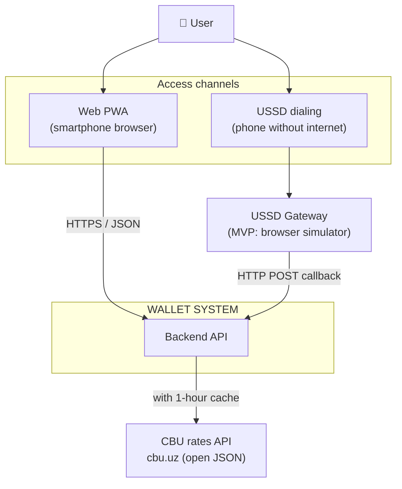

### 8.2 Containers (C2)

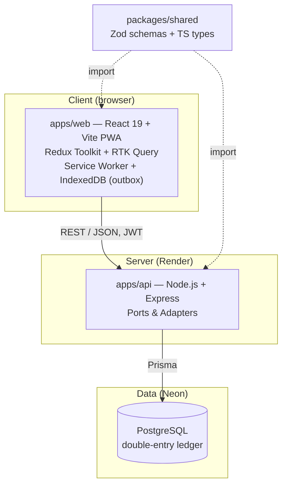

**Key rule:** `packages/shared` imports nothing; `apps/*` import only `packages/*`; `apps/*` **never** import each other. The dependency direction is one-way. It is currently held by review rather than by a rule: `biome.json` has no `noRestrictedImports` entry yet, so the guard named here is a plan, not a control. Wiring it is tracked in `docs/PARKING.md`.

### 8.3 Backend internal layers (C3) — Ports & Adapters

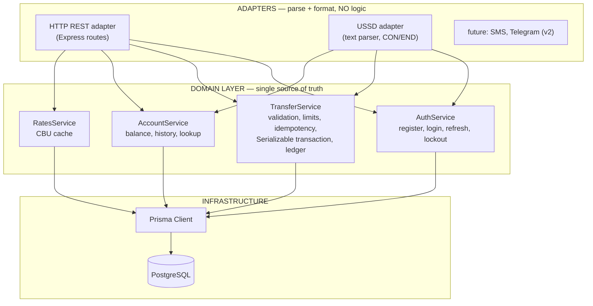

**Layer contract:** domain services know nothing about `req`/`res`, HTTP status codes, or `CON`/`END`. They receive plain input objects and return either a result or a typed domain error (`InsufficientFunds`, `LimitExceeded`). Turning an error into an HTTP `422` or an `END Insufficient funds` is the adapter's job. This is why the USSD channel (phase B6) plugs in without changing **a single line** of the domain.

### 8.4 Technology stack

| Layer      | Choice                                         | Rationale (ADR)                      |
| ---------- | ---------------------------------------------- | ------------------------------------ |
| Language   | TypeScript `strict`                            | Type safety on both sides            |
| Frontend   | React 19 + Vite                                | —                                    |
| State      | Redux Toolkit + RTK Query                      | ADR-0003                             |
| Validation | Zod (`packages/shared`)                        | One schema → server + client + types |
| Styling    | Tailwind CSS                                   | Mobile-first                         |
| Backend    | Node.js + Express                              | —                                    |
| ORM        | Prisma                                         | Interactive transactions, migrations |
| DB         | PostgreSQL (Neon)                              | ACID, `Serializable`                 |
| Hashing    | argon2                                         | OWASP                                |
| Testing    | Vitest, Supertest, Testing Library, Playwright | Section 18                           |
| CI/CD      | GitHub Actions                                 | Section 19                           |
| Deploy     | Vercel + Render + Neon                         | Free tier                            |

## 9. Data model

### 9.1 ER diagram

```mermaid
erDiagram
    USER ||--|| ACCOUNT : "owns (MVP one-to-one)"
    USER ||--o{ REFRESH_TOKEN : "sessions"
    USER ||--o{ AUTH_ATTEMPT : "login attempts"
    ACCOUNT ||--o{ LEDGER_ENTRY : "financial entries"
    TRANSFER ||--|{ LEDGER_ENTRY : "exactly 2 entries"
    ACCOUNT ||--o{ TRANSFER : "sent (from)"
    ACCOUNT ||--o{ TRANSFER : "received (to)"
    TRANSFER |o--|| IDEMPOTENCY_RECORD : "key"

    USER {
        uuid id PK
        string phone UK "+998..., unique"
        string firstName
        string lastName
        string passwordHash "Argon2id"
        string pinHash "Argon2id, nullable"
        datetime pinLockedUntil "nullable"
        enum role "USER | SYSTEM"
        datetime createdAt
    }
    ACCOUNT {
        uuid id PK
        uuid userId FK
        string currency "UZS"
        bigint balance "cached snapshot, tiyin"
        enum type "USER | TREASURY"
        datetime createdAt
    }
    TRANSFER {
        uuid id PK
        uuid fromAccountId FK
        uuid toAccountId FK
        bigint amount "tiyin, > 0"
        enum status "PENDING | COMPLETED | FAILED"
        enum type "P2P | TOPUP"
        enum channel "WEB | USSD"
        string idempotencyKey UK
        string failReason "nullable"
        datetime createdAt
        datetime completedAt "nullable"
    }
    LEDGER_ENTRY {
        uuid id PK
        uuid accountId FK
        uuid transferId FK
        bigint amount "signed tiyin, never 0"
        bigint balanceAfter "balance after this entry"
        datetime createdAt "immutable"
    }
    IDEMPOTENCY_RECORD {
        uuid userId PK_FK "scoped per client, P-8"
        string key PK "UUID, client-generated"
        string requestHash "payload SHA-256"
        json response "stored response"
        int statusCode
        datetime expiresAt "creation +24h"
    }
    REFRESH_TOKEN {
        uuid id PK
        uuid userId FK
        uuid familyId "device family"
        string tokenHash "SHA-256, raw never stored"
        datetime usedAt "nullable — reuse detector"
        datetime revokedAt "nullable"
        datetime expiresAt
    }
    AUTH_ATTEMPT {
        uuid id PK
        uuid userId FK
        boolean succeeded
        datetime createdAt
    }
```

### 9.2 Key design notes

| Decision                                                            | Rationale                                                                                   |
| ------------------------------------------------------------------- | ------------------------------------------------------------------------------------------- |
| `REFRESH_TOKEN.tokenHash` — the raw token is never stored in the DB | Even a DB leak cannot hijack sessions                                                       |
| `familyId`                                                          | One chain per device; on detected reuse the whole family is killed via `revokedAt` (FR-2.7) |
| `IDEMPOTENCY_RECORD.requestHash`                                    | Distinguishes same key + different payload (FR-4.4 → `409`)                                 |
| `IDEMPOTENCY_RECORD` keyed on `(userId, key)`                       | The key alone put every client in one namespace, so one could occupy a value another was about to use — a denial of service on the money path (P-8) |
| `TRANSFER.initiatedBy`                                              | Who asked. Not derivable from the accounts: a top-up leaves the treasury, so its sender belongs to nobody. Scopes the transfer's own idempotency key |
| `LEDGER_ENTRY.balanceAfter`                                         | Balance snapshot on every entry — makes audits O(1) and simplifies reconciliation           |
| `TRANSFER.channel`                                                  | For channel limits (FR-6.1) and analytics                                                   |
| `AUTH_ATTEMPT` as a separate table                                  | Tracks lockout counts without adding columns to `USER`; history is retained for audit       |

### 9.3 Money model

- All amounts are **`BIGINT`** in **minor units** (ISO 4217). For UZS the exponent is `2`, i.e. tiyin: `1 250 000 so'm = 125 000 000 tiyin`.
- The exponent is **per currency** and lives in the registry (`CURRENCIES`). ISO 4217 defines currencies with exponents `0`, `1`, `2` and `3` — which is why `/ 100` is never hardcoded.
- Reason: IEEE 754 doubles (JS `number`) cannot represent monetary values exactly (`0.1 + 0.2 ≠ 0.3`).
- **Amounts in API JSON are strings:** `"amount": "125000000"` — so that `JSON.parse` cannot lose precision. (Prices being strings in the Peg B API — same reason.)
- Canonical form: unsigned, no leading zeros (`"0100"` is rejected) — so that one value has exactly one representation.
- **Registry ≠ policy:** `CURRENCIES` is reference data (ISO code, symbol, exponent, formatting rules); `TRANSFER_LIMITS` is policy (which currency may be transferred and within what bounds). The set of supported currencies is **derived** from the limits. MVP: `UZS` only.
- Formatting (`1 250 000 so'm`, `$1,250.50`) lives in `shared` as `formatMoney`, because both the web client and the USSD adapter need it.

### 9.4 Treasury and money flow

There is no real money, yet the double-entry principle must not be broken: **every credit must come from somewhere.** For this, a single `TREASURY` account owned by the `SYSTEM` user exists — the "mint" for demo money. It is the only account allowed a negative balance (a DB `CHECK` constraint conditioned on `type`).

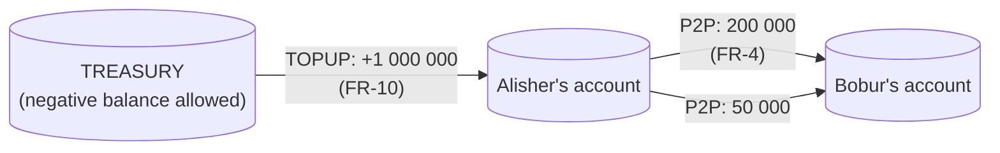

Result: across the system, `sum(all ledger entries) = 0` — always, without exception.

### 9.5 Ledger invariants

These are the core of the test plan (Section 18) — each is verified automatically:

| #   | Invariant                                                            | How it is enforced                                                                                         |
| --- | -------------------------------------------------------------------- | ---------------------------------------------------------------------------------------------------------- |
| I-1 | `sum(all LEDGER_ENTRY.amount) = 0`                                   | Double-entry: every transfer is a ± pair                                                                   |
| I-2 | Every `COMPLETED` transfer has exactly 2 ledger entries summing to 0 | Created inside a single DB transaction (FR-4.3)                                                            |
| I-3 | A ledger entry is never modified or deleted                          | A DB rule forbidding `UPDATE`/`DELETE` + no such method exists in the repository API at the code layer     |
| I-4 | `Account.balance = sum(that account's entries)`                      | Snapshot updated in every transaction; daily reconciliation compares them, any difference = critical alert |
| I-5 | `balance ≥ 0` on accounts of type `USER`                             | Application check + DB `CHECK`                                                                             |
| I-6 | No ledger entries for `FAILED`/`PENDING` transfers                   | Entries are created only on the success path                                                               |

---

# PART V — CORE FLOWS

## 11. Flow diagrams

### 11.1 Registration (FR-1)

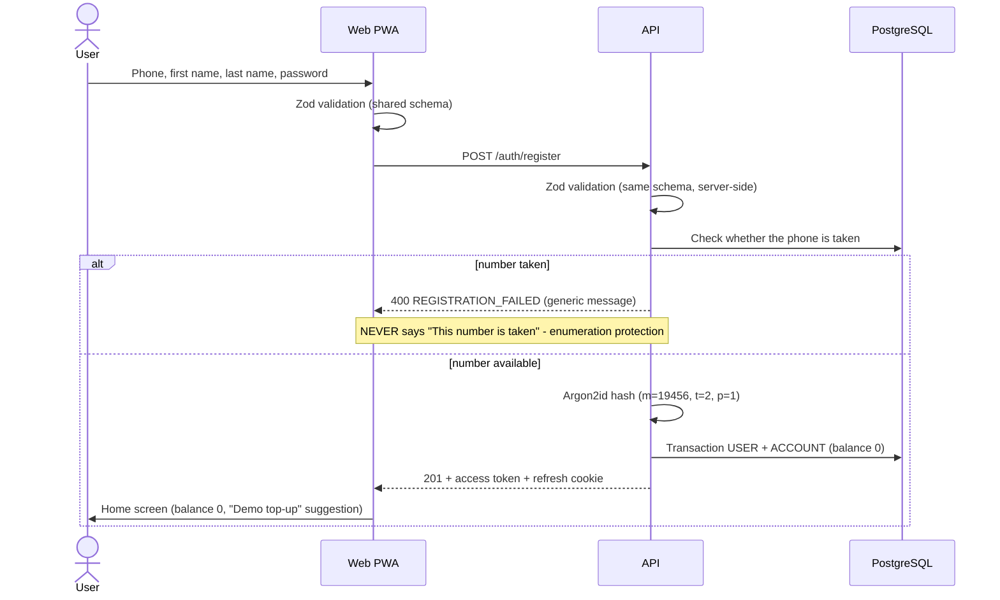

### 11.2 Login and lockout (FR-2.1–2.3)

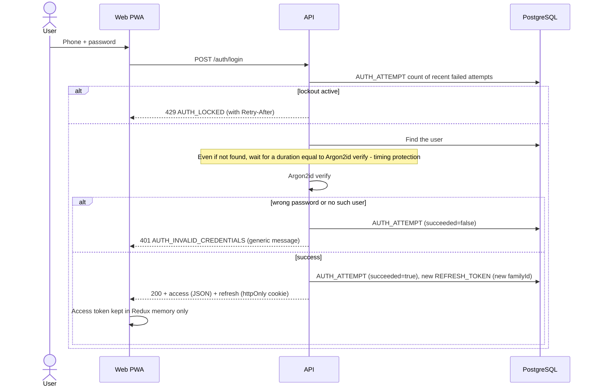

### 11.3 Token refresh: rotation and reuse detection (FR-2.6, FR-2.7)

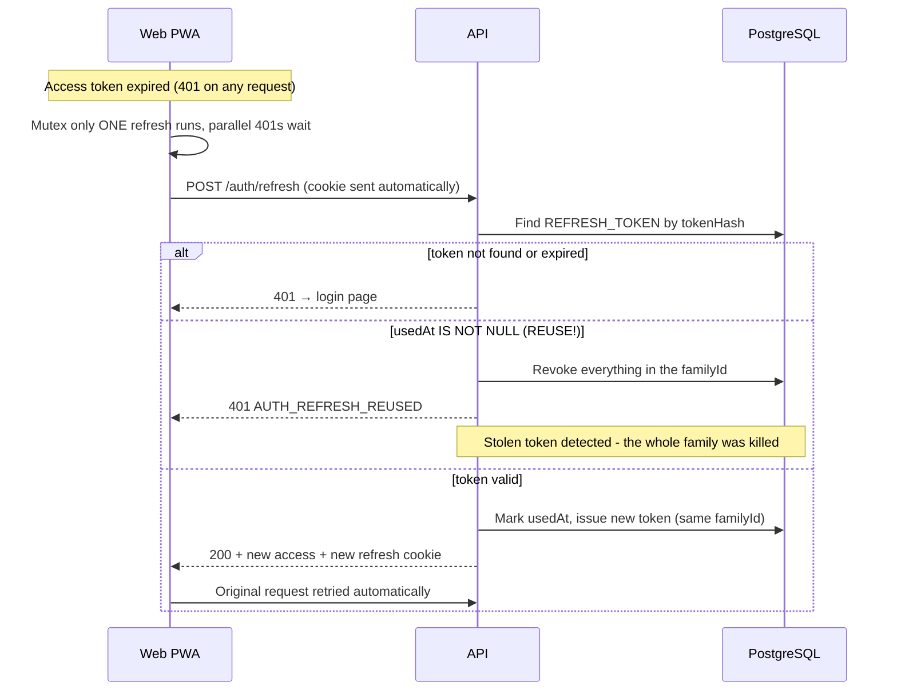

### 11.4 Money transfer — full flow (FR-4)

The heart of the system. Every step is numbered:

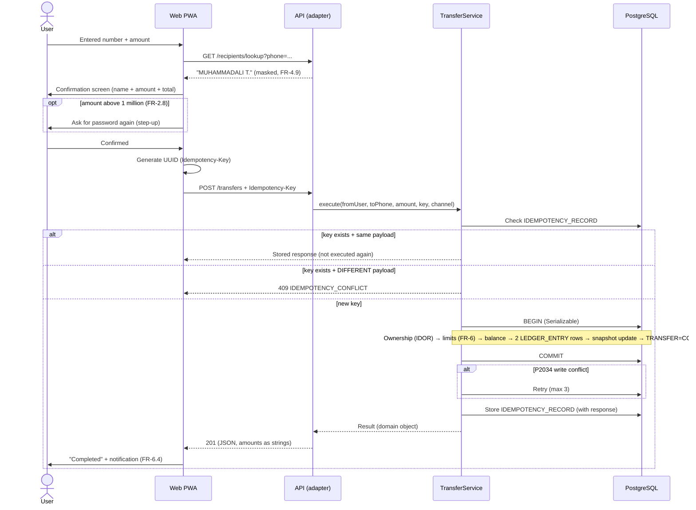

### 11.5 Transfer state machine (FR-4.8)

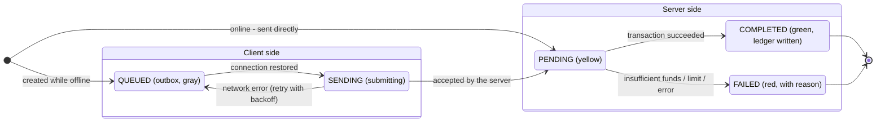

**UI rule:** `QUEUED` and `SENDING` are never rendered in green or with the word "completed" (FR-4.8). Color system — 13.6.

### 11.6 Offline outbox synchronization (FR-8.3, FR-8.4)

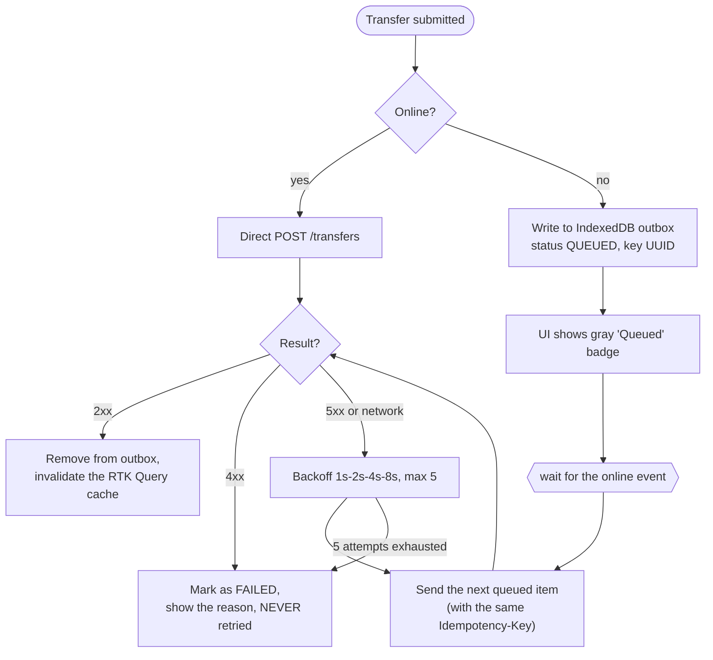

**Why this is safe:** the send always uses the same `Idempotency-Key` — even if the network drops and "did it arrive?" is unknown, resending never creates a second transfer (FR-4.4).

### 11.7 USSD session (FR-9)

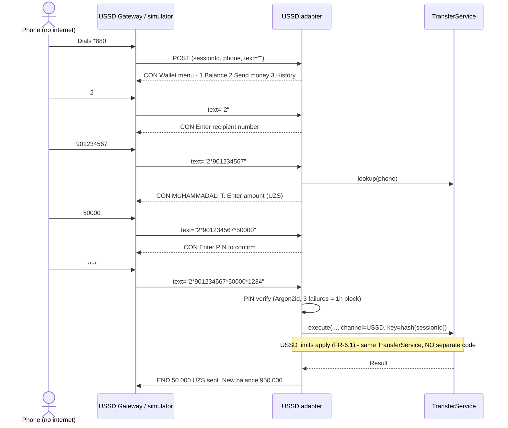

USSD state machine (parsing `text`):

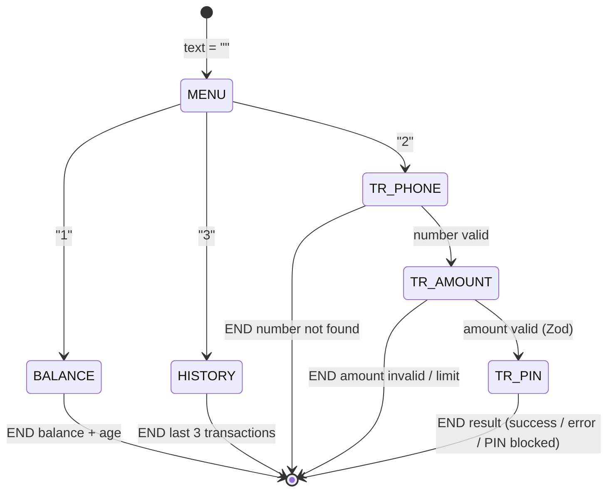

**Idempotency over USSD:** the key is `hash(sessionId + step)` — even if the gateway delivers a request twice, only one transfer is created.

---

# PART VI — API CONTRACT

## 12. API

### 12.1 Endpoints

| Method | Path                                             | Description                                          | Auth                  | FR             |
| ------ | ------------------------------------------------ | ---------------------------------------------------- | --------------------- | -------------- |
| POST   | `/api/auth/register`                             | Registration                                         | —                     | FR-1           |
| POST   | `/api/auth/login`                                | Login                                                | —                     | FR-2           |
| POST   | `/api/auth/refresh`                              | Token refresh (rotation)                             | cookie                | FR-2.6         |
| POST   | `/api/auth/logout`                               | Logout (revokes the current family)                  | cookie                | FR-2           |
| GET    | `/api/me`                                        | Current user                                         | ✅                    | —              |
| PUT    | `/api/me/pin`                                    | Set/change the USSD PIN (with password confirmation) | ✅                    | FR-1.6, FR-9.5 |
| GET    | `/api/accounts`                                  | Account and balance                                  | ✅                    | FR-3           |
| POST   | `/api/accounts/topup`                            | Demo top-up (Idempotency-Key)                        | ✅                    | FR-10          |
| GET    | `/api/recipients/lookup?phone=`                  | Masked name (20/hour limit)                          | ✅                    | FR-4.9         |
| POST   | `/api/transfers`                                 | Money transfer (Idempotency-Key mandatory)           | ✅                    | FR-4           |
| GET    | `/api/transfers?cursor=&from=&to=&direction=&status=&limit=` | History                                              | ✅                    | FR-5           |
| GET    | `/api/rates`                                     | Exchange rates                                       | ✅                    | FR-7           |
| POST   | `/api/channels/ussd`                             | USSD gateway callback                                | gateway secret header | FR-9           |
| POST   | `/api/channels/ussd/simulate`                    | The same callback, dialled by the logged-in user     | ✅                    | FR-9.6         |
| GET    | `/health`                                        | Service + DB status                                  | —                     | NFR-5          |

### 12.2 Conventions

- **Amounts:** always strings in JSON (`"amount": "5000000"`), in tiyin (9.3).
- **Idempotency-Key:** UUID v4, client-generated; mandatory on every money-moving POST (`/transfers`, `/accounts/topup`) — a request without a key gets `400`. A key is **single-use for good**: the stored response is kept for 24 hours (FR-4.4), and after that the key is retired rather than freed, because the transfer row keeps it permanently. Reusing a key past its retention returns `409 IDEMPOTENCY_CONFLICT`, which is a client error and is not retried. A client generates a fresh UUID per request, so this only bites a client that is already wrong.
- **Pagination:** cursor-based; response includes `nextCursor` (`null` on the last page). Offset pagination is not used (new rows shift the pages).
- **Dates:** ISO 8601 UTC (`2026-08-11T14:30:00Z`); converting to local time is the client's job.
- **Versioning:** none in the MVP; on a breaking change, `/api/v2/...` (a v2 decision).

### 12.3 Error catalog

Single format:

`{ "error": { "code": "...", "message": "...", "requestId": "...", "details": [...] } }`

**The code is the contract, not the text.** `code` is a stable, language-neutral identifier; the user-facing text is derived from it by the **client**. `message` is only a fallback (for logs and debugging). Adding a second language therefore means adding a dictionary, never touching the contract.

The two kinds of error identity never get mixed up:

|                      | What                                               | Example                | Where                  |
| -------------------- | -------------------------------------------------- | ---------------------- | ---------------------- |
| **API error code**   | The whole request failed; exactly one per response | `INSUFFICIENT_FUNDS`   | `error.code`           |
| **Field error code** | One field is wrong; there may be several           | `phone.invalid_format` | `error.details[].code` |

Field codes appear inside `VALIDATION_ERROR` (which field failed) and inside `LIMIT_EXCEEDED` (which limit was hit, via the `limit.*` family). The three framework codes above exist because a request that never reaches a handler — a wrong path, an unparseable body, an oversized body — must still return this envelope: a client is told to parse every failure with it, and Express would otherwise answer with an HTML page or, worse, a retryable `INTERNAL`. HTTP status codes live in an `API_ERROR_STATUS` map kept **next to** the code list — enforced at the type level so the two cannot drift apart.

| Code                       | HTTP | When                                         | User-facing message                                                                                            |
| -------------------------- | ---- | -------------------------------------------- | -------------------------------------------------------------------------------------------------------------- |
| `VALIDATION_ERROR`         | 400  | Zod rejected the input (fields in `details`) | Shown under the field                                                                                          |
| `REGISTRATION_FAILED`      | 400  | Registration rejected (reason hidden)        | "Registration failed. Check your details." (original: "Ro'yxatdan o'tib bo'lmadi. Ma'lumotlarni tekshiring.")  |
| `AUTH_INVALID_CREDENTIALS` | 401  | Login failed (reason hidden)                 | "Login failed. Incorrect number or password." (original: "Kirish amalga oshmadi. Raqam yoki parol noto'g'ri.") |
| `AUTH_TOKEN_EXPIRED`       | 401  | Access token expired — the client refreshes and retries. **Never returned by `/auth/refresh` itself**: telling a client whose refresh failed to refresh is a loop | (invisible — automatic refresh)                                                                |
| `AUTH_REFRESH_REUSED`      | 401  | Reuse detection fired                        | "Please sign in again for security reasons."                                                                   |
| `AUTH_REFRESH_INVALID`     | 401  | The refresh credential is unknown, revoked or expired | "Your session has ended. Please sign in."                                                             |
| `AUTH_LOCKED`              | 429  | Lockout active (`Retry-After` header)        | "Too many attempts. Try again in X minutes."                                                                   |
| `RATE_LIMITED`             | 429  | General rate limit / lookup limit            | "Too many requests. Please wait a moment."                                                                     |
| `NOT_FOUND`                | 404  | No route matches the path, or the method is not allowed on it | "This page is no longer available."                                           |
| `MALFORMED_BODY`           | 400  | The request body is not parseable JSON       | (technical error — with a support ID)                                                                          |
| `PAYLOAD_TOO_LARGE`        | 413  | The request body exceeds the size limit      | (technical error — with a support ID)                                                                          |
| `RECIPIENT_NOT_FOUND`      | 404  | Lookup: number not in the system             | "This number is not registered with Wallet."                                                                   |
| `SELF_TRANSFER_FORBIDDEN`  | 422  | Sending to oneself                           | "You cannot send money to yourself."                                                                           |
| `INSUFFICIENT_FUNDS`       | 422  | Balance too low                              | "Insufficient funds."                                                                                          |
| `LIMIT_EXCEEDED`           | 422  | FR-6 limits (which limit — in `details`, via the `limit.*` field codes) | "Limit exceeded: ..."                                                                                          |
| `IDEMPOTENCY_CONFLICT`     | 409  | Same key + different payload                 | (technical error — with a support ID)                                                                          |
| `STEP_UP_REQUIRED`         | 422  | A transfer above 1 000 000 UZS arrived without the password (FR-2.8) | "Confirm with your password." |
| `STEP_UP_FAILED`           | 422  | That confirmation was wrong — deliberately **not** 401, which would send the client to refresh a healthy session and retry | "The password did not match." |
| `PIN_NOT_SET`              | 422  | USSD transfer without a PIN                  | "Set your PIN in the app first."                                                                               |
| `PIN_LOCKED`               | 429  | 3 wrong PIN attempts                         | "PIN is blocked. Try again in 1 hour."                                                                         |
| `RATES_UNAVAILABLE`        | 503  | The central bank is unreachable and this process holds no cached rate (FR-7.2) | "Kurslar hozircha mavjud emas." — the wallet is fully usable without them |
| `INTERNAL`                 | 500  | Unexpected error (logged with `requestId`)   | "Technical failure. The operation was not performed."                                                          |

**Principle:** 4xx — client error, never retried (FR-8.4); 5xx — server error, retryable with backoff, because idempotency makes it safe.

---

# PART VII — UI/UX SPECIFICATION

## 13. UI/UX

### 13.1 Design principles

1. **Mobile-first, thumb-first.** Base viewport 360×640. The primary CTA (Send money) sits at the bottom of the screen, in the thumb zone, fixed. Navigation — bottom tab bar (3 tabs: Home, History, Profile).
2. **Trust design.** In a financial app the UI never lies: every number carries its age (if served from cache), every transaction carries its exact state. There is no "probably sent" state — only definite states (11.5).
3. **One screen — one decision.** The transfer is split into 4 separate steps (13.5); one question per step. In fintech, cognitive load = money sent to the wrong place.
4. **An error is not a dead end.** Every error screen offers a next step ("Insufficient funds" → "Demo top-up" button).

### 13.2 Design token system

> **Real sources studied:** the token nomenclature and hierarchy are taken from Stripe's Elements Appearance API (variable list verified against the official documentation: `colorPrimary`, `colorBackground`, `colorText`, `colorTextSecondary`, `colorTextPlaceholder`, `colorDanger`, `colorSuccess`, `colorWarning`, `iconColor`, `fontFamily`, `fontSizeBase/Xs/Sm/Lg/Xl`, `spacingUnit`, `borderRadius` — and, most importantly, the **paired contrast tokens**: `accessibleColorOnColorPrimary`, `accessibleColorOnColorSuccess`, and so on). The fluid-scale methodology comes from Utopia (utopia.fyi). Every color pair has been **computed and verified programmatically** against the WCAG 2.1 formula (results below).

#### 13.2.1 Three-layer architecture

```
Layer 1: PRIMITIVES        blue-600, gray-900, 16px, 1.25...
                           components NEVER touch these
                              │
Layer 2: SEMANTIC          color-primary, color-text-secondary,
                           color-on-primary, space-m, text-step-1
                           the whole app uses ONLY these
                              │
Layer 3: COMPONENT         button-height, input-radius
                           only where genuinely needed
```

Implementation: every token lives in `:root` as a CSS custom property — the **single source of truth**; the Tailwind config binds to them (not the other way around). Dark mode is nothing more than re-declaring layer 2 (the primitives never change). Writing raw hex/px values inside components is **forbidden** — enforced by a stylelint rule. This is exactly Stripe's split between `variables` (global) and `rules` (component level).

#### 13.2.2 Semantic color tokens — WCAG-verified

Contrast for every pair was computed with the WCAG 2.1 relative luminance formula (requirement: text ≥ 4.5:1, large text/icons ≥ 3:1 — NFR-4):

| Token                  | Light     | Dark      | Usage                          | Contrast (light/dark)     |
| ---------------------- | --------- | --------- | ------------------------------ | ------------------------- |
| `color-background`     | `#FFFFFF` | `#0C111D` | Page background                | —                         |
| `color-surface-sunken` | `#F9FAFB` | `#161B26` | Background behind cards        | 16.98 against text ✓      |
| `color-text`           | `#101828` | `#F0F4F8` | Primary text                   | **17.75 / 17.06** ✓       |
| `color-text-secondary` | `#475467` | `#98A2B3` | Secondary text, age indicators | **7.69 / 7.32** ✓         |
| `color-primary`        | `#175CD3` | `#84ADFF` | CTAs, links, active tab        | as text **5.99 / 8.44** ✓ |
| `color-on-primary`     | `#FFFFFF` | `#0C111D` | Text on a primary background   | **5.99** ✓                |
| `color-success`        | `#067647` | `#47CD89` | COMPLETED, incoming (+)        | **5.69 / 9.31** ✓         |
| `color-danger`         | `#B42318` | `#F97066` | FAILED, outgoing (−), errors   | **6.57 / 6.77** ✓; on `surface-sunken` **6.29 / 6.18** ✓ |
| `color-warning`        | `#B54708` | `#FDB022` | PENDING, stale-data banner     | **5.43 / 10.25** ✓        |
| `color-neutral`        | `#667085` | `#85888E` | QUEUED, disabled elements      | —                         |

Following the Stripe pattern, every "background" color has an `on-*` counterpart — a component never has to guess which text color will work on it.

**Color choice in context (the real market):** in the Uzbek fintech market Payme is green-teal, Click is blue, Uzum is purple. The values above are a **placeholder ramp that exists to prove the system**; the brand decision is made separately, but whichever hex is picked, it enters through this table (with its contrast computed) — the system matters more than the values.

#### 13.2.3 Fluid typography and spacing (the Utopia method)

Instead of jumping at breakpoints, the browser interpolates between two scales: **a 1.2 ratio at 360px (16px base)** → **a 1.25 ratio at 1280px (18px base)**. Every step is expressed with `clamp()` — the values are computed:

| Token          | 360px | 1280px | CSS value                                    | Usage                |
| -------------- | ----- | ------ | -------------------------------------------- | -------------------- |
| `text-step--1` | 13.3  | 14.4   | `clamp(13.33px, 12.92px + 0.116vw, 14.4px)`  | Helper text, badges  |
| `text-step-0`  | 16    | 18     | `clamp(16px, 15.22px + 0.217vw, 18px)`       | **Body text (base)** |
| `text-step-1`  | 19.2  | 22.5   | `clamp(19.2px, 17.91px + 0.359vw, 22.5px)`   | Sub-headings         |
| `text-step-2`  | 23    | 28.1   | `clamp(23.04px, 21.05px + 0.553vw, 28.12px)` | Section headings     |
| `text-step-3`  | 27.7  | 35.2   | `clamp(27.65px, 24.71px + 0.816vw, 35.16px)` | Screen titles        |
| `text-step-4`  | 33.2  | 44     | `clamp(33.18px, 28.96px + 1.17vw, 43.95px)`  | Balance figure       |

The spacing scale is paired with the type scale (the Utopia pattern) — from `space-3xs` (4→4.5) to `space-2xl` (64→72), all built with `clamp()`; padding/margin/gap come **only** from these tokens:

| Token       | 360px → 1280px | Token       | 360px → 1280px |
| ----------- | -------------- | ----------- | -------------- |
| `space-3xs` | 4 → 4.5        | `space-m`   | 24 → 27        |
| `space-2xs` | 8 → 9          | `space-l`   | 32 → 36        |
| `space-xs`  | 12 → 13.5      | `space-xl`  | 48 → 54        |
| `space-s`   | 16 → 18        | `space-2xl` | 64 → 72        |

**Two hard rules:**

1. The minimum for `text-step-0` is 16px — this is not an aesthetic call: iOS Safari auto-zooms the page when input text is smaller than 16px (which breaks forms).
2. Breakpoints survive for **layout** only (at ≥1024px the bottom tab bar becomes a side panel); sizing and spacing are never driven by breakpoints — the fluid scale handles that on its own.

#### 13.2.4 Remaining tokens

| Token                            | Value                     | Note                                                                      |
| -------------------------------- | ------------------------- | ------------------------------------------------------------------------- |
| `font-family`                    | Inter, system-ui fallback | `font-variant-numeric: tabular-nums` — on every amount (column alignment) |
| `radius-card` / `radius-control` | 12px / 8px                | —                                                                         |
| `touch-target-min`               | 44px                      | NFR-3; the touch area stays this size even when the icon is smaller       |
| `safe-area-*`                    | `env(safe-area-inset-*)`  | Notch/home indicator; the bottom CTA and the tab bar account for it       |
| Height unit                      | `dvh` (not `vh`)          | So the layout does not jump when the mobile browser URL bar collapses     |

**Number formatting rule:** amounts are digit-grouped (`1 250 000`), the currency follows the number (`so'm`), outgoing amounts get `−` + `color-danger`, incoming get `+` + `color-success`.

### 13.3 Screen map

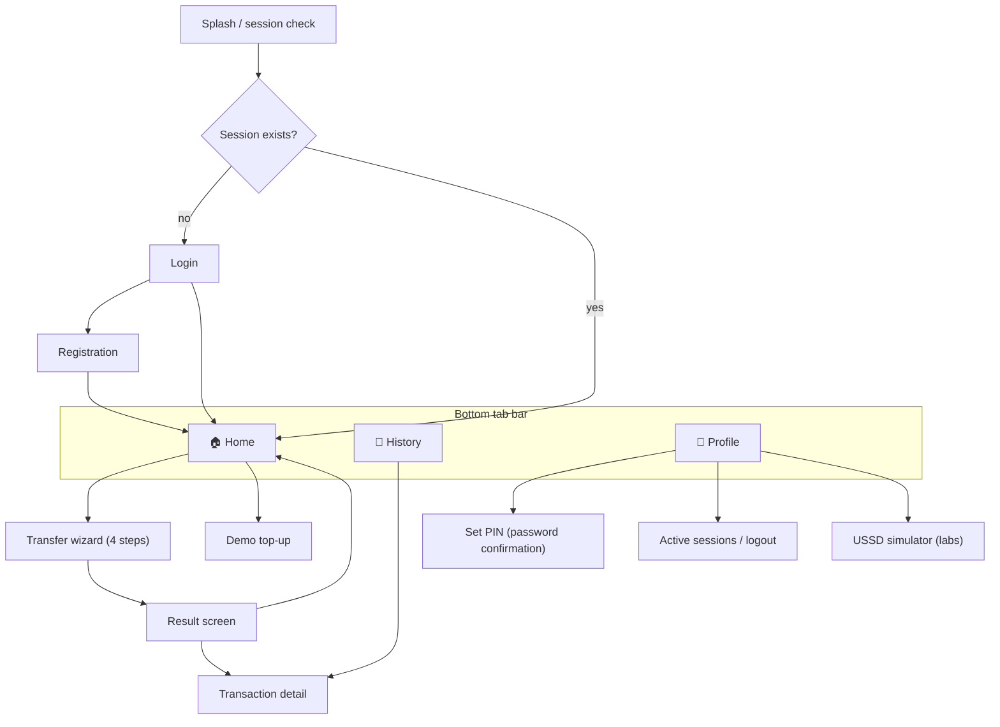

### 13.4 Screen specifications

For every screen: purpose, key elements, **mandatory states** (loading / empty / error / offline).

| Screen                 | Key elements                                                                                                                  | States                                                                                                                         |
| ---------------------- | ----------------------------------------------------------------------------------------------------------------------------- | ------------------------------------------------------------------------------------------------------------------------------ |
| **Login**              | Phone (mask: `+998 __ ___ __ __`), password, "Sign in" CTA, register link                                                     | loading (button spinner, disabled); error (generic message, not per-field — FR-2.2); lockout (with remaining time)             |
| **Registration**       | 4 fields, password strength indicator (length-based — not composition!), FR-6.5 copy                                          | field-level Zod errors; generic error (FR-1.5)                                                                                 |
| **Home**               | Balance card (large number + age indicator FR-3.4), "Send money" CTA, "Demo top-up", rates widget (FR-7), last 5 transactions | skeleton loading; balance 0 + empty history → onboarding suggestion ("Try a demo top-up"); offline banner                      |
| **Transfer wizard**    | See 13.5                                                                                                                      | per-step                                                                                                                       |
| **Result**             | Large status icon, amount, recipient, transaction ID (copy button), "Home" / "Details"                                        | COMPLETED / FAILED (reason + next step) / QUEUED ("will be sent when connectivity returns")                                    |
| **History**            | Filter panel (in the URL — FR-5.2), list grouped by day, infinite scroll (cursor)                                             | skeleton; empty ("No transactions yet"); filter-empty ("No transactions match this filter" + clear) ; offline (cache + banner) |
| **Transaction detail** | Full record: ID, date, parties, status history (timeline), channel badge (WEB/USSD)                                           | —                                                                                                                              |
| **Profile**            | Name, masked phone, PIN status (set/not set), session list, "Sign out everywhere", dark mode                                  | PIN setup flow: password → new PIN → repeat                                                                                    |
| **Offline banner**     | Global, on every screen: "No connection — data from cache" + last sync time                                                   | detected via a combination of `navigator.onLine` + request failures                                                            |

### 13.5 Transfer wizard (4 steps)

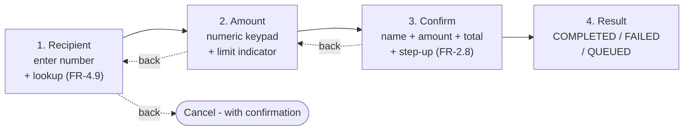

Step rules:

1. **Number:** masked input; on a successful lookup a name card appears (Continue is enabled only then); otherwise the `RECIPIENT_NOT_FOUND` message. A recent-recipients list (quick pick).
2. **Amount:** large numeric input; current balance and the per-operation cap below it; exceeding a limit produces a real-time error (client-side via the same shared Zod, without waiting for `LIMIT_EXCEEDED`). **The remaining daily allowance is not shown**, and that is a deliberate omission rather than an oversight: the API exposes no such figure, and the only way to compute one on the client is to sum today's outgoing transfers from a paged history — correct until somebody makes more transfers in a day than one page holds, and silently wrong after that. A wrong allowance on a money screen is worse than an absent one. Showing it needs the server to return it (P-32).
3. **Confirm:** everything on one card; once "Send" is pressed, `status='submitting'` — the button locks (double-tap protection, which together with idempotency forms two layers of defense); above 1 million → the password field appears right here.
4. **Result:** according to the state in 11.5; on `FAILED`, the reason + a suggested action.

Wizard state lives in `transferSlice` (Redux) and is lost on page reload (deliberately: a half-finished money operation is never restored — that is safer).

### 13.6 Status color system (tied to FR-4.8)

| Status    | Color            | Icon    | Copy                              |
| --------- | ---------------- | ------- | --------------------------------- |
| QUEUED    | `neutral` gray   | clock   | "Queued — waiting for connection" |
| SENDING   | `neutral`        | spinner | "Sending..."                      |
| PENDING   | `warning` yellow | clock   | "Processing"                      |
| COMPLETED | `success` green  | check   | "Completed"                       |
| FAILED    | `danger` red     | cross   | "Failed: {reason}"                |

Color is never the only signal (for color-blind users) — always icon + text (NFR-4).

### 13.7 A11y requirements (NFR-4 detail)

- Transfer wizard steps are announced via `aria-live="polite"`; the result screen uses `role="status"`.
- The balance-age banner uses `role="alert"` (when going offline).
- All icons are `aria-hidden` + have a text equivalent; amounts are read as "outgoing: one million so'm", not "minus one million so'm".
- Focus order in the wizard is logical; modals trap focus when opened and restore it when closed.

### 13.8 Forms and validation

> The rules are verified against web.dev's official guidance on payment forms (payment-and-address-form-best-practices).

#### 13.8.1 Field specification

| Field            | `type`     | `inputmode` | `autocomplete`               | Note                                                                                                                                                                 |
| ---------------- | ---------- | ----------- | ---------------------------- | -------------------------------------------------------------------------------------------------------------------------------------------------------------------- |
| Phone            | `tel`      | —           | `tel`                        | A mask is displayed (`+998 __ ___ __ __`), stored as E.164 (`+998901234567`); a single field — never split into segments (web.dev rule)                              |
| Password (login) | `password` | —           | `current-password`           | So password managers work                                                                                                                                            |
| Password (new)   | `password` | —           | `new-password`               | Lets the browser offer a strong password                                                                                                                             |
| Amount           | `text`     | `numeric`   | `transaction-amount`         | **NOT `type="number"`** — web.dev: increment arrows are meaningless and error-prone for money/card/phone values; live digit grouping (`1 250 000`) as the user types |
| PIN              | `password` | `numeric`   | `off`                        | 4 digits; numeric keyboard on the device                                                                                                                             |
| First/last name  | `text`     | —           | `given-name` / `family-name` | Unicode pattern (`\p{L}`) — NOT a Latin-only regex (web.dev)                                                                                                         |

#### 13.8.2 Validation policy

| Rule          | Description                                                                                                                                      | Source/Rationale                                               |
| ------------- | ------------------------------------------------------------------------------------------------------------------------------------------------ | -------------------------------------------------------------- |
| Single source | Every rule lives in the Zod schemas in `packages/shared`; client-side form errors and server responses come from **one** schema                  | 8.2, NFR-1.6                                                   |
| Timing        | During entry (on blur, or as soon as the format is complete), without waiting for submit; on submit, every problematic field is surfaced at once | web.dev: "validate during entry — not just on form submission" |
| Placement     | The error text sits below the field, wired up with `aria-describedby`; color is never the only signal (icon + text)                              | NFR-4                                                          |
| Submit button | Not disabled up front (it leaves the user guessing — web.dev); disabled once pressed (duplicate-submit protection)                               | FR-4.8, S-6                                                    |
| Label         | One `label` per input (`for`/`id`); a placeholder is not a label substitute                                                                      | web.dev                                                        |
| Layout        | Single column; `enterkeyhint` matches the next step (`next`/`done`/`send`)                                                                       | web.dev                                                        |
| Error copy    | Non-blaming and action-oriented: "The number must be 9 digits" (❌ "Invalid input")                                                              | 13.1                                                           |

### 13.9 Defensive UX — edge-case matrix

The real test of a fintech UI is the unhappy paths. Defined behavior for each:

| #    | Scenario                                                                  | System behavior                                                                                                                                                        | Defense layer    |
| ---- | ------------------------------------------------------------------------- | ---------------------------------------------------------------------------------------------------------------------------------------------------------------------- | ---------------- |
| D-1  | "Send" double-tapped in quick succession                                  | UI: `status='submitting'` → the button goes dead; server: Idempotency-Key                                                                                              | Two layers (S-6) |
| D-2  | The access token expires mid-wizard                                       | `baseQueryWithReauth` refreshes silently and the wizard carries on; if the refresh token is dead too → login, and the wizard state is **not** restored (safer)         | 11.3, 13.5       |
| D-3  | The connection drops during submit                                        | The request goes to the outbox → `QUEUED`; even if the response was lost, resending under the same key is safe                                                         | FR-8.3, FR-4.4   |
| D-4  | The user sits on the confirm screen for 5 minutes and the balance changes | The server always validates against current state → `INSUFFICIENT_FUNDS` is shown with fresh data; the client-side check is UX only                                    | NFR-1.6          |
| D-5  | The app is killed after submit but before the response                    | On reopen the history is loaded from the server — the truth lives server-side; the transfer state is visible                                                           | FR-5             |
| D-6  | The number is edited rapidly during lookup                                | 400ms debounce + stale responses discarded (only the last request's result is rendered)                                                                                | 13.5             |
| D-7  | A phone number is pasted with spaces/parentheses                          | Normalized (to E.164) at the input layer, not treated as an error                                                                                                      | 13.8.1           |
| D-8  | The Android back button inside the wizard                                 | Goes one step back (it does not exit the app); on step 1 — cancel with confirmation                                                                                    | 13.5             |
| D-9  | Browser autofill writes into the wrong field                              | Correct `autocomplete` attributes prevent it; Zod catches it before submit anyway                                                                                      | 13.8.1           |
| D-10 | The device clock is wrong                                                 | Every timestamp comes from the server; the client clock is not used even for display (dates come from the server too)                                                  | 12.2             |
| D-11 | Slow network: 15s with no response                                        | Client timeout 20s → the request is treated as being in an unknown state → idempotent retry policy (FR-8.4); the UI does not lie by sitting in a "still sending" state | FR-4.8           |
| D-12 | The USSD session drops mid-transfer (180s)                                | Nothing has been executed — money only moves on the final step (after the PIN); a half-finished session leaves no trace                                                | 11.7             |

---

# PART VIII — IMPLEMENTATION PLAN

> Three tracks: **B** (backend), **F** (frontend), **I** (integration). Every phase carries a DoD (Definition of Done); the DoD always references FR/test scenarios. No code belongs in this document — the plan defines _what_ gets built and _in what order_.

## 14. Backend track

| Phase  | Name                      | Scope                                                                                                                                   | DoD                                                             |
| ------ | ------------------------- | --------------------------------------------------------------------------------------------------------------------------------------- | --------------------------------------------------------------- |
| **B0** | Skeleton                  | Express + TS + pino + `/health`; error middleware (12.3 format); Prisma + Neon connection; `requestId`                                  | `/health` returns 200 with a DB check; error format test        |
| **B1** | Schema and migration      | The 7 tables from 9.1; `CHECK` constraints (I-5, treasury exception); seed: SYSTEM user + TREASURY account                              | `prisma migrate` passes on a clean database; seed is idempotent |
| **B2** | Auth                      | Register, login (timing-safe), JWT + refresh rotation/reuse (FR-2.6/2.7), logout, `/me`. FR-2.3's per-account backoff, counted against a keyed digest of the number so an unregistered one backs off identically — a counter that skipped strangers would answer the fourth attempt with 429 for a customer and 401 for anyone else. **Deferred to September:** step-up (FR-2.8) and PIN setup (FR-1.6) — see `docs/runbook.md` §4 | FR-1, FR-2 integration tests; Section 18 S-4, S-5 green         |
| **B3** | Domain: ledger + transfer | `TransferService` (channel-agnostic!), idempotency, Serializable + P2034 retry, limits (FR-6.1–6.3), lookup + rate limit, topup (FR-10) | S-1, S-2, S-3 green; I-1…I-6 invariant tests                    |
| **B4** | History and rates         | Cursor pagination, filters; CBU cache (FR-7); notification records (FR-6.4)                                                             | FR-5 tests; degradation test with CBU down                      |
| **B5** | Hardening                 | helmet, CORS allowlist, rate limits, `yarn npm audit` clean; log audit (NFR-5.2)                                                            | Security checklist (17.3) complete                              |
| **B6** | USSD adapter              | `text` parser (state machine 11.7), PIN verify + block, session idempotency, gateway secret                                             | FR-9 tests; response time < 3s                                  |

**B3 is the most critical phase.** It gets the most time; B4 does not start before it (the ledger is the foundation).

## 15. Frontend track

| Phase    | Name                     | Scope                                                                                                                                                                                                                                                                                 | DoD                                                                                                                                                            |
| -------- | ------------------------ | ------------------------------------------------------------------------------------------------------------------------------------------------------------------------------------------------------------------------------------------------------------------------------------- | -------------------------------------------------------------------------------------------------------------------------------------------------------------- |
| **F0**   | Skeleton + design system | Vite + React + TS; **the token layers (13.2): primitives → semantic → component, as CSS custom properties**; the Tailwind config binds to the tokens; fluid `clamp()` scales; dark mode (re-declaring layer 2); stylelint rule banning raw hex/px; router; tab bar + safe-area layout | Lighthouse a11y ≥ 90; **automated contrast test** (the 13.2.2 pairs are checked in CI); visual check at 320/360/768/1280px; a PR containing a raw hex fails CI |
| **F0.5** | Form primitives          | `Input`, `AmountInput` (live grouping, `inputmode=numeric`), `PhoneInput` (mask + E.164 normalization), `PinInput`, `FormField` (label + error + `aria-describedby`); the Zod ↔ form binding                                                                                          | Every attribute in the 13.8.1 table is covered by a test; verified that iOS does not zoom (16px)                                                               |
| **F1**   | Store                    | Redux Toolkit + RTK Query base; `authSlice`; `baseQueryWithReauth` + **mutex** (11.3)                                                                                                                                                                                                 | Refresh flow tested against a mock server; parallel-401 test                                                                                                   |
| **F2**   | Auth screens             | Login, registration (13.4); shared Zod client validation                                                                                                                                                                                                                              | FR-1/FR-2 UI flows; error states                                                                                                                               |
| **F3**   | Home + top-up            | Balance card + age (FR-3.4), rates widget, demo top-up, recent transactions                                                                                                                                                                                                           | Skeleton/empty/offline states                                                                                                                                  |
| **F4**   | Transfer wizard          | The 4 steps from 13.5; `transferSlice` state machine; step-up; double-tap protection                                                                                                                                                                                                  | S-6 (UI): button dead while submitting; all step validations                                                                                                   |
| **F5**   | History                  | Filters (URL sync), cursor infinite scroll, detail screen                                                                                                                                                                                                                             | FR-5; filter-empty state                                                                                                                                       |
| **F6**   | PWA + outbox             | Service worker, IndexedDB cache (reads), outbox (11.6), offline banner                                                                                                                                                                                                                | FR-8; **installability proven directly** — manifest parses with a maskable icon, the service worker controls the page, and a reload with the network off still renders the shell (Lighthouse dropped its PWA category in v12, so "Lighthouse PWA green" is no longer a thing that can be measured); Lighthouse accessibility ≥ 90; offline demo scenario |
| **F7**   | USSD simulator (labs)    | Phone-screen UI, gateway protocol emulation (with B6)                                                                                                                                                                                                                                 | FR-9.6; GIF for the README                                                                                                                                     |

## 16. Integration track

| Phase  | When        | What                                                                                            | Verification                                          |
| ------ | ----------- | ----------------------------------------------------------------------------------------------- | ----------------------------------------------------- |
| **I0** | After B0+F0 | Contract: the Zod schemas in `packages/shared` wired into both sides; local CORS + cookie setup | A register request travels from the browser to the DB |
| **I1** | B2+F2       | Auth flow live: login → refresh → logout; cookie attributes production-like                     | Scenarios 11.2, 11.3 in a browser                     |
| **I2** | B3+F4       | Transfer live: lookup → wizard → result; error codes rendered correctly in the UI               | S-1…S-3 from a browser; a UI for every code in 12.3   |
| **I3** | B4+F5       | History + rates live                                                                            | Filter → URL → reload → state preserved               |
| **I4** | B5+F6       | E2E in a preview environment (Playwright): the full scenario                                    | The 18.3 E2E suite green on preview                   |
| **I5** | B6+F7       | USSD simulator ↔ adapter                                                                        | The 11.7 session passes end to end                    |

**Contract-first rule:** every new endpoint appears first as a schema in `packages/shared` (request + response + error codes). Both BE and FE build against it — integration reduces to "I imported the schema".

---

# PART IX — SECURITY

## 17. Threat model

### 17.1 STRIDE analysis

| Threat (STRIDE)            | Concrete scenario                                                                | Control                                                                                            | Where                    |
| -------------------------- | -------------------------------------------------------------------------------- | -------------------------------------------------------------------------------------------------- | ------------------------ |
| **S**poofing               | Session continuation with a stolen refresh token                                 | Rotation + reuse detection → family revocation                                                     | FR-2.6/2.7, 11.3         |
|                            | Forged JWT (`alg:none`, algorithm confusion)                                     | Algorithm pinned to HS256; library configuration under test                                        | FR-2.5                   |
|                            | Using someone else's phone number over USSD (SIM clone/swap)                     | Mandatory PIN + low channel limits                                                                 | FR-9.5, FR-6.1, NFR-1.11 |
| **T**ampering              | Tampering with the request payload (amount manipulation, negative amounts)       | Server-side Zod (positive integer, min/max); client validation is UX only                          | NFR-1.6, FR-4.7          |
|                            | Modifying a ledger entry                                                         | Immutability (I-3): DB rule + no update in the repository API                                      | 9.5                      |
| **R**epudiation            | "I never sent this money"                                                        | Every operation: ledger pair + `channel` + `requestId` logs + the transaction ID shown to the user | FR-5.3, NFR-5            |
| **I**nformation disclosure | User enumeration (harvesting the number base via register/login/lookup)          | Generic messages + timing-safe + lookup rate limit 20/hour                                         | FR-1.5, FR-2.2, FR-4.9   |
|                            | PII/secrets in logs                                                              | Log redaction list; code review checklist item                                                     | NFR-5.2                  |
|                            | Token theft via XSS                                                              | Access token in memory only, refresh httpOnly; CSP (helmet)                                        | FR-2.4, NFR-1.8          |
| **D**enial of service      | Login bombardment                                                                | Account lockout + IP rate limit combined                                                           | FR-2.3                   |
|                            | Transfer spam                                                                    | Velocity check + daily limits + rate limit                                                         | FR-6.1–6.3               |
| **E**levation of privilege | IDOR: sending money from someone else's account / reading someone else's history | Ownership predicate on every request; S-3 is a mandatory test                                      | FR-4.5, 18.2             |
|                            | CSRF (the cookie-bearing refresh endpoint)                                       | `SameSite=Strict` + CORS allowlist; refresh only rotates tokens, it never moves money              | FR-2.4                   |

### 17.2 Fraud (the non-technical threat)

The primary channel of money loss is deceiving the user. The controls live at the product layer: the name on the confirmation screen (FR-4.6), the new-recipient limit (FR-6.2), velocity (FR-6.3), the permanent warning copy (FR-6.5), a notification on every outgoing transaction (FR-6.4). These do not fit into STRIDE, but they are a first-class part of this spec.

### 17.3 Security checklist (phase B5 DoD)

- [x] helmet active, CSP configured (`default-src 'none'` — an API serves no documents); CORS an explicit allowlist, never `*`
- [x] Idempotency-Key enforcement tested on `/transfers` and `/accounts/topup`
- [x] `yarn npm audit` clean; gitleaks in CI, pinned by image digest; `.env.example` present, `.env` untracked
- [x] Log redaction tested against the bytes pino writes, including the access log's URL and query
- [x] Every error code in 12.3 tested against the status table, transcribed by hand rather than read from the map
- [~] Rate limit and lookup limit each covered by an integration test. **Lockout (FR-2.3) is deferred to September** by runbook §4, so its test does not exist yet — the row is not fully green and says so.

---

# PART X — TESTING, CI/CD, DEPLOYMENT

## 18. Test strategy

### 18.1 Pyramid

| Level       | Tooling                     | Coverage                                                            | Runs                            |
| ----------- | --------------------------- | ------------------------------------------------------------------- | ------------------------------- |
| Unit        | Vitest                      | Zod schemas, money formatting, USSD parser, selectors, backoff math | Every commit                    |
| Integration | Supertest + Docker Postgres | Auth, transfer, idempotency, IDOR, lockout — against a real DB      | Every PR                        |
| Component   | Testing Library             | Wizard, filters, state rendering                                    | Every PR                        |
| E2E         | Playwright                  | 18.3                                                                | In the preview environment (I4) |

### 18.2 Mandatory scenarios (no merge unless they pass)

| #   | Scenario                                                                                                                         | Verifies     |
| --- | -------------------------------------------------------------------------------------------------------------------------------- | ------------ |
| S-1 | POST twice with the same `Idempotency-Key` → 2 ledger entries (not 4), identical responses                                       | FR-4.4, I-2  |
| S-2 | 2 parallel transfers, balance covers only one → one COMPLETED, one FAILED, balance ≥ 0                                           | FR-4.3, I-5  |
| S-3 | Transfer from someone else's account / request for someone else's history → 403/404, no data leaks                               | FR-4.5       |
| S-4 | Used refresh token replayed → entire family revoked, subsequent requests get 401                                                 | FR-2.7       |
| S-5 | Login response for a non-existent number ≡ response for an existing number + wrong password (text + status; **timing ratio max/min < 1.5**, measured over ≥5 samples) | FR-2.2       |
| S-6 | Double-tapping "Send" in the wizard → one request (UI layer) + one transfer (server layer)                                       | FR-4.8, 13.5 |
| S-7 | `sum(ledger) = 0` after every test suite (global invariant check)                                                                | I-1          |
| S-8 | USSD: full transfer session; 3 wrong PINs → 1h block                                                                             | FR-9         |
| S-9 | Outbox: offline transfer → online → sent automatically → COMPLETED; no retry on 4xx                                              | FR-8.3/8.4   |

## 19. CI/CD

### 19.1 Pipeline

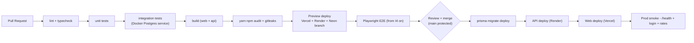

**Order matters:** migration → API → Web. Migrations are written backward-compatible — the old API must keep working against the new schema (both are live during the deploy window).

### 19.2 Git conventions

- `main` is protected; work happens on `feat/*`, `fix/*`, `chore/*` branches; Conventional Commits; the PR template asks "which FR / S-scenario does this relate to".

## 20. Deployment and observability

### 20.1 Topology

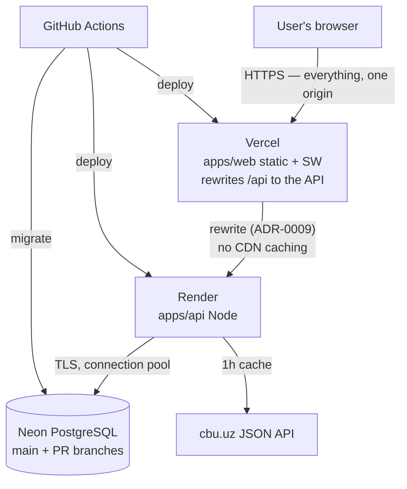

**One origin, deliberately (ADR-0009).** The browser never addresses the API
directly. `vercel.app` and `onrender.com` are separate registrable domains and
both are on the Public Suffix List, so a `SameSite=Strict` refresh cookie
(FR-2.4) cannot span them — refresh passes every test, because supertest and
local development both use a single host, and fails on the first real deploy
with no error, just sessions that stop renewing. The rewrite makes `/api`
same-origin, which keeps FR-2.4 exactly as written.

Two things follow. The CDN must store nothing: Vercel honours upstream
`cache-control` on external rewrites by default for projects created on or after
6 April 2026, and a cached `GET /api/accounts` is one user's balance shown to
another — so caching is disabled in `vercel.json` *and* the API sends
`Cache-Control: no-store`. And the proxy chain gained a hop, so the `trust proxy`
count that every rate limit depends on must be measured against the real
deployment (T-6.3), not assumed.

### 20.2 Environment variables

| Name                    | Where       | Notes                                            |
| ----------------------- | ----------- | ------------------------------------------------ |
| `DATABASE_URL`          | Render / CI | Neon connection string                           |
| `JWT_SECRET`            | Render      | 256-bit random; rotation procedure in the README |
| `REFRESH_COOKIE_DOMAIN` | Render      | Production domain                                |
| `CORS_ORIGINS`          | Render      | Comma-separated list                             |
| `USSD_GATEWAY_SECRET`   | Render      | Callback authentication                          |
| `VITE_API_URL`          | Vercel      | Build-time                                       |

_(None of these are stored in git; `.env.example` serves as documentation.)_

### 20.3 Known constraints

- The Render free tier has **cold starts** (~30-60s after sleep) — called out in the README; an UptimeRobot ping is optional.
- The Neon free tier auto-suspends — the first query may be slow.

### 20.4 Observability (NFR-5 detail)

- pino JSON logs → the Render log stream; every log line carries `requestId`, `userId` (when present), latency.
- Daily reconciliation (I-4): snapshot vs `sum(ledger)` — any discrepancy is logged at level `fatal` (this must never happen).
- `/health`: DB ping + the name of the latest migration.

---

# PART XI — DECISIONS, PLAN, RISKS

## 21. Decision log (v1.0 open questions closed)

| #           | Question (v1.0)                    | Decision (v2.0)                                                                                                      | Rationale                                                                                                 |
| ----------- | ---------------------------------- | -------------------------------------------------------------------------------------------------------------------- | --------------------------------------------------------------------------------------------------------- |
| Q-1         | Are the PIN and password separate? | Separate. The PIN is 4 digits, USSD only; set in the profile with password confirmation; never asked at registration | Typing a long password over USSD is impractical; the channel separation matches the limit policy (FR-6.1) |
| Q-2         | How do notifications work?         | MVP: in-app (DB record + UI badge). Telegram bot — v2                                                                | FR-6.4 is satisfied with no external dependency                                                           |
| Q-3         | Multi-currency?                    | v2. MVP is UZS only; the model already has a `currency` field — the expansion path is open                           | Scope control                                                                                             |
| Q-4 _(new)_ | Where does the balance come from?  | Treasury + demo top-up (FR-10, 9.4)                                                                                  | Double-entry stays intact; I-1 holds                                                                      |
| Q-5 _(new)_ | Should the refresh token be a JWT? | No — an opaque random value, hashed in the DB                                                                        | Revocation needs the DB anyway; a JWT adds nothing and adds risk                                          |

## 22. Master plan

The task-level execution plan lives in a separate document: **`docs/runbook.md`**. It defines numbered tasks per day (`T-x.y`), the files each one touches, the acceptance criteria, and the single verification command (`yarn verify`). The spec says _what_ gets built; the runbook says _in what order and verified how_.

### 22.1 Deadline and scope

As of 25 Aug the real pace is **5–6 hours/day**, with **6 days** left to 31 Aug — about 33 hours. The full MVP needs ~124 hours, so the deadline was balanced against scope:

|                                        | By 31 Aug | September |
| -------------------------------------- | --------- | --------- |
| Contracts (`packages/shared`)          | ✅        | —         |
| Backend: auth, ledger, transfer, topup | ✅        | —         |
| Mandatory tests S-1…S-5, S-7           | ✅        | —         |
| CI + deployed API                      | ✅        | —         |
| Frontend (F0–F7)                       | —         | ✅        |
| USSD adapter, PWA offline, SSE         | —         | ✅        |
| Lockout/step-up, history, rates        | —         | ✅        |

Rationale: most of the portfolio value sits in the ledger layer — double-entry, `Serializable`, idempotency, IDOR protection. One backend that is correct end to end is a stronger signal than five half-finished flows.

## 23. Risks

| Risk                            | Impact                 | Mitigation                                                                          |
| ------------------------------- | ---------------------- | ----------------------------------------------------------------------------------- |
| Scope creep                     | Project never finishes | Section 3 is frozen; any new idea → the v2 list                                     |
| Ledger bug                      | Data corruption        | I-1…I-6 automated tests; S-7 global check; reconciliation                           |
| Serializable + retry complexity | B3 overruns            | Ready-made pattern from the Prisma docs; the S-2 test is written first (TDD)        |
| Free-tier cold starts           | Poor demo impression   | README warning; ping                                                                |
| No real USSD gateway            | Incomplete demo        | The simulator is protocol-compliant; Africa's Talking sandbox is an optional add-on |
| One-person team                 | Bugs slip through      | Self-review checklist on PRs; AI review for critical files                          |

## 24. Glossary

| Term             | Meaning                                                                            |
| ---------------- | ---------------------------------------------------------------------------------- |
| Ledger           | An immutable journal of financial entries; the balance is derived from it          |
| Double-entry     | Every operation produces two entries: debit + credit; the total is always 0        |
| Treasury         | The demo-money issuance account (the only account allowed a negative balance)      |
| Idempotency      | Repeating an operation N times = executing it once                                 |
| Outbox           | Client-side queue of operations that have not yet reached the server               |
| IDOR             | Unauthorized access to another user's resource by ID                               |
| Minor units      | The smallest unit of a currency (tiyin)                                            |
| Ports & Adapters | An architecture that isolates business logic from I/O channels                     |
| Rotation         | Replacing the refresh token on every use                                           |
| Token family     | One device's refresh chain; fully revoked on reuse                                 |
| Reconciliation   | Comparing the snapshot against the ledger sum                                      |
| Step-up          | Additional authentication for high-value operations                                |
| STRIDE           | Threat taxonomy: Spoofing, Tampering, Repudiation, Info disclosure, DoS, Elevation |
| ADR              | Architecture Decision Record                                                       |
| Design token     | A named, machine-readable unit of a design decision                                |
| Fluid scale      | A scale that interpolates continuously across the viewport, with no breakpoints    |
| PSP              | Payment Service Provider                                                           |
| Webhook          | A provider-initiated server-to-server notification                                 |

---

# APPENDIX A — Payment provider integration (v2 roadmap)

> This section is **out of** MVP scope (Section 3). Its purpose is to prove that today's architecture can absorb real payments **without a rewrite**. Within this spec it is treated as an "extension contract".

## A.1 Why we prepare for it today

When a real PSP is added, three things change: money enters the system **from the outside**, the result arrives **asynchronously** (webhook), and the provider brings **its own idempotency model**. If none of this is anticipated, the ledger and the transfer state machine have to be rewritten. The decisions below prevent that — and **all of them are already in the MVP**:

| Decision already in the MVP  | What it buys in v2                                                                                            |
| ---------------------------- | ------------------------------------------------------------------------------------------------------------- |
| Treasury account (9.4)       | Becomes the PSP account: `TOPUP` is already a treasury→user transfer, only its source becomes real            |
| Double-entry ledger (FR-4.2) | Fees, refunds, chargebacks — all of them are just additional entry pairs, not a new model                     |
| The `Transfer.channel` field | `PAYME`/`CLICK`/`CARD` join `WEB`/`USSD`                                                                      |
| Idempotency (FR-4.4)         | Webhooks arrive more than once — the protection is already in place                                           |
| Ports & Adapters (8.3)       | A PSP is one more adapter; `TransferService` is left untouched                                                |
| The `PENDING` state (FR-4.8) | Today it is short-lived; in v2 it becomes the asynchronous waiting state — the machine itself does not change |

## A.2 Extended money flow

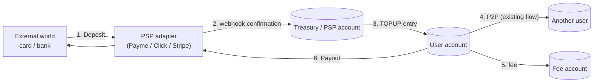

The invariant does not change: `sum(all ledger entries) = 0` — external money also enters through the treasury.

## A.3 Asynchronous payment state machine

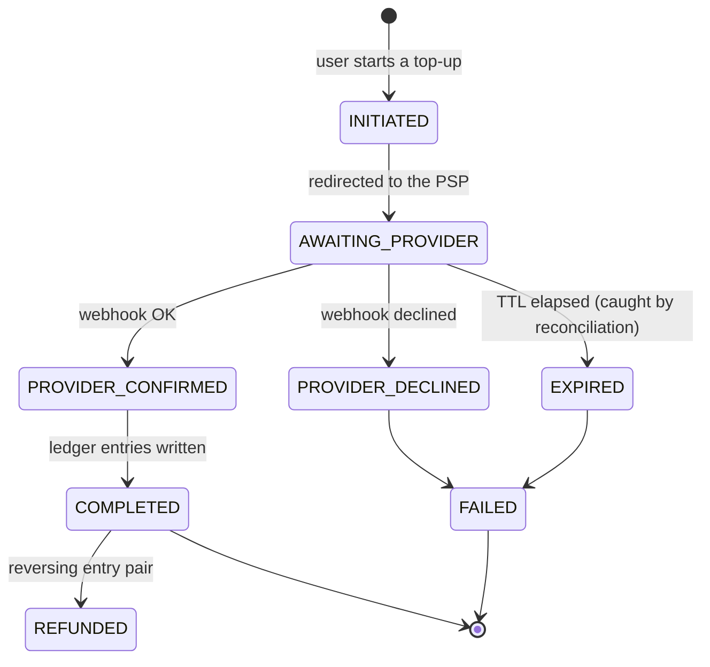

**Important:** it is the `PROVIDER_CONFIRMED → COMPLETED` transition that writes to the ledger — not the arrival of the webhook itself. The two are kept separate because webhooks arrive duplicated and out of order.

## A.4 Webhook security (sketch of the v2 requirements)

| Requirement                                                                   | Rationale                                                    |
| ----------------------------------------------------------------------------- | ------------------------------------------------------------ |
| Signature verification (HMAC) on every webhook, with constant-time comparison | A forged webhook = free money                                |
| Idempotency keyed on the provider event ID                                    | Every PSP delivers at least once — duplicates are guaranteed |
| Tolerance for out-of-order delivery (never regress to an earlier state)       | The network guarantees no ordering                           |
| Amount/currency taken **from the provider response**, never from the client   | The client is never a source of money                        |
| Reconciliation: PSP statement ↔ ledger, daily                                 | Nothing else catches a lost webhook                          |
| A dedicated rate limit and IP allowlist on the webhook endpoint               | DoS and spoofing                                             |

## A.5 The Uzbekistan context

A real integration with providers such as Payme, Click or Uzum Bank requires **a contract and a registered legal entity** — outside the scope of a portfolio project. The v2 plan is therefore two-stage: first a **PSP adapter in sandbox mode** (a fake provider with the real protocol shape) to prove the architecture; then, if it is ever needed, a real provider is dropped in behind that same adapter. This is exactly the approach taken with USSD (FR-9.6).

---

## Sources

**Design-system sources:** the token nomenclature and the `accessibleColorOn*` pairing pattern — [Stripe Elements Appearance API](https://docs.stripe.com/elements/appearance-api) (variable list taken from the official documentation); the fluid type/space methodology — [Utopia](https://utopia.fyi/blog/designing-with-fluid-type-scales); the form and validation rules — [web.dev: Payment and address form best practices](https://web.dev/articles/payment-and-address-form-best-practices); the contrast values were **computed programmatically** with the WCAG 2.1 relative luminance formula (every number in the 13.2.2 table is verified).

**Verified against primary sources:** Argon2id parameters, password policy, lockout and generic error messages — [OWASP Password Storage](https://cheatsheetseries.owasp.org/cheatsheets/Password_Storage_Cheat_Sheet.html) and [OWASP Authentication](https://cheatsheetseries.owasp.org/cheatsheets/Authentication_Cheat_Sheet.html); JWT algorithm rules — [OWASP JWT](https://cheatsheetseries.owasp.org/cheatsheets/JSON_Web_Token_Cheat_Sheet.html); Serializable + P2034 retry — [Prisma Transactions](https://www.prisma.io/docs/orm/prisma-client/queries/transactions); Redux rules — [Redux Style Guide](https://redux.js.org/style-guide/), [Organizing State](https://redux.js.org/faq/organizing-state); GSM/USSD weaknesses — [ITU/FIGI Security testing for USSD](https://www.itu.int/en/publications/Documents/tsb/2020-FIGI-Security-testing-for-USSD-and-STK/files/basic-html/page12.html); PSTN RESTRICTED — [NIST SP 800-63B](https://pages.nist.gov/800-63-3/sp800-63b.html); CBU rates API — verified live (2026-08-11); USSD gateway protocol — Africa's Talking documentation (via a secondary source).

**Author's design decisions (not standards, tunable):** token lifetimes (15 min / 30 days), all UZS limits (FR-6, FR-10), velocity values, the NFR-2 numbers, the choice of HS256 (a single service signs and verifies its own tokens — with multiple verifiers, switch to RS256), coverage targets.

_— End of document —_
